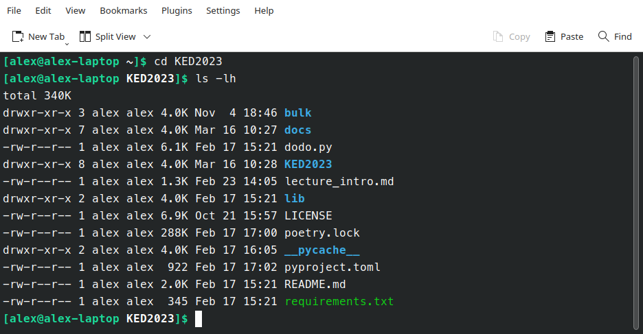

## Recap last Lecture

- Successful installation? :white_check_mark: 	
- Scripting :dart:
  - automate, document, reproduce
- Any questions:question:


::: notes

- Installation
  - Installation erfolgreich?
  - unklare Dinge im Guide?
  - Voraussetzung für weitere Sessions
- Projektorganisation zentral
- Programmieren bedeutet Organisation von Daten, Ideen/Forschungsinteresse
  -  iterative Entwicklung
  - Reproduktion
  - Komplexität ist nachvollziehbar!

:::

## Outline

- learn principles of the shell :classical_building:
- perform shell commands :arrow_forward:
- get practice by solving exercises  :building_construction: 


::: notes

- heute Einführung in Shell, nächstes Mal tatsächlich nützliche Dinge
- Commands statt Klicks
- Wieso Shell (und nicht Python?)
  - Grundverständnis Dateisystem
  - einfacher und effizienter als Python, Denken/Konzepte sehr ähnlich
- Shell ist Cockpit bis zu Osterferien
- Metaziel
  - sanfter Einstieg ins Programmieren
  - Verstehen, was wichtig ist in Computerinteraktion


:::


## How to get started

### Open a Shell

:::::::::::::: {.columns}

:::{.column width="50%"}

#### macOS

- open `Terminal`
- shell type: `zsh`

:::

:::{.column width="50%"}

#### Windows

- open `Ubuntu 22.04 LTS`
- shell type: `Bash`
- ~~open Windows Command Prompt~~

:::

:::::::::::::: 


::: notes

- interaktiv: Studis sollen Bash auch öffnen
  - rasch durchgehen, damit mehr Übungszeit bleibt

- Shell Commands platformübergreifend
- Shell zeigen: Erscheinungsbild je System unterschiedlich

:::

## Bourne-again Shell

:::::::::::::: {.columns}

:::{.column width="40%"}

### Bash

- offers many built-in tools
- shell prompt
  - `USER@HOSTNAME:~$`
- home directory
  - `~` refers to `/home/USER`
- case-sensitive
- no feedback :thumbsup:
  - unless there is an issue


:::

:::{.column width="60%"}



:::

:::::::::::::: 


::: notes

- Computersteuerung komplett über CLI möglich
  - unnütze Verdoppelung zu GUI?
  - schnelle Inspektion von Daten
  - wichtig für alle Datei-Operationen, skalierbar für Tausende Dateien
  - manche Programme nur über Shell verfügbar 
- Home Directory ist Anfangspunkt im Filesystem, ähnlich einem Spielbrett
- Empfehlung: konsequente Nutzung CLI
  - Vertrauen, Geschwindigkeit
  - Anfang braucht Gewöhnung

  - Vorteilen von beiden nutzen
- no need to memorize syntax

  - slides, google, stackoverflow
  - wiederkehrendes auto-erinnern
- Eigenschaften

  - extremely fast
  - kompakter Code -> komplexe Prozessierung

:::


## Unix Philosophy{data-background=#4d7e65} 

Build small programs that *do one thing* <br>and *do it well*. :nerd_face:


## Basic Commands in Shell

### Say hello!


```bash
echo "hello world"		# print some text
man echo				# get help for any command (e.g., echo)
```


::: notes

- CLI: Eingabe + Ausgabe gleiches Fenster
- Tradition von hello world
- quotes to preserve formatting
- Hilfeseiten sehr umfangreich
  - googlen oft schneller --> stackoverflow

:::

## General Structure of Commands

### Example parts of a command

```bash
command -a --long_argument FILE 	# non-working example command
```


# Storing Files{data-background="../images/drawer_unsplash.jpg" .white-text}

## ... and how to find them

:::::::::::::: {.columns}
::: {.column}

- hierarchical filesystem :evergreen_tree:

  - folders/directories
  - files with a suffix (e.g. `.jpg`)


:::

::: {.column}

```bash
.
├── README.md
└── lectures
    ├── images
    │   └── ai.jpg
    ├── html
    │   ├── KED2023_01.html
    │   └── KED2023_02.html
    └── md
        ├── KED2023_01.md
        └── KED2023_02.md
```

:::

::::::::::::::


::: notes

- Sehr wichtig, aber hat in Vergangenheit Probleme bereitet ("Cloud/App-Abstraktion")
- verschachtelte, hierarchische Struktur
  - wie Aktenschrank mit Ordner
- Navigation in diesem Baum/Aktenschrank (tiefer/höher)
- / für Angabe von Pfad (Verzeichnis/Unterverzeichnis)
- Ordner / Dateien --> Endungen
  - keine technische Notwendigkeit

:::


## Relative vs. Absolute Paths 

- absolute paths start from top-level directory
  - begins with `/` (uppermost folder)
  - e.g. `/home/alex/KED2023/slides/KED2023_01.html` 
- relative paths when looking from current directory
  - begins with the name of a folder or file
  - e.g. `KED2023/slides/KED2023_01.html`
  

. . .

:warning: Only relative paths work across systems


::: notes

- absoluter Pfad beginnt mit Slash, relativer ohne Slash

:::

## Important Places in your Filesystem

- shortcut names of directories

  -  `.` current dir
  -  `..` parent dir
  -  `~` home dir (e.g. `/home/alex`)
- find your files on Windows 
  - `/mnt/c/Users/USERNAME/` (replace with your USERNAME)
  - shortcut via `documents`

::: notes

- Windows-Leute hinweisen auf Pfad innerhalb Ubuntu

:::


## Navigating in a File System

```bash
pwd 				# show absolute path of current directory

ls 					# list content of current directory
ls -lh				# list with more information
ls dirname			# list content of directory dirname

cd ..				# change directory to go folder up
cd dir/subdir		# go to folder dir/subdir (two folders down)
```

. . .

### When you are lost, open the file manager (GUI)

```bash
open . 			# open path in Finder (macOS)
explorer.exe .	# open Explorer in WSL Ubuntu (Windows)
```


::: notes

- Befehle sind Abkürzungen 
  - cd = change directory
  - ls = list
- diskutieren von ls output
  - Berechtigung/Eigentümer/Grösse/Mod.-datum/Name
  - d für directory
- beliebige Verzeichnisse springen
  - cd zurück ins home
- Kommentare mit #
- Es gibt nur ein Filesystem
  - über GUI oder CLI einzusehen


<!-- nautilus .		# open path in file manager (Ubuntu) -->

:::


## Open Files

### Show within Shell

```bash
more text.txt			# print content (spacebar to scroll)

head text.txt			# print first 10 lines of file
tail -5 text.txt		# print last 5 lines of file
```


## Useful Key Actions

- autocompletion: `TAB`
- history of used commands: :arrow_up:
- scrolling: `SPACEBAR`
- cancel: `CTRL + C`
- quit: `q` or `CTRL + D`


::: notes

- lange Dateinamen, Programme nur halb erinnert
- q bspw. in Hilfe-Seite man

:::


## Creating, Moving and Copying

### Create files and directories

```bash
touch test.txt		# create a new file

mkdir data			# make a new directory
mkdir -p data/1999	# make a new directory with a subfolder
```

### Copy and move files

```bash
cp test.txt other/.				# copy file into other folder, keep its name			
mv test.txt other/new_name.txt	# move or rename a file
```

::: notes

- touch abängig, ob Datei existiert
- mkdir -p für Subdirs

:::

## Removing Files{data-background=#b5533c}

Watch out, there is no recycle bin. No way back!

```bash
rm old.txt 			# remove a file
rm -r old_data		# remove a folder with all its files
```


## In-class: Exercises I{data-background=#3c70b5}

1. Create a new directory called `tmp`.
2. Change into that directory using `cd` and print its absolute path using `pwd`.
3. Use `touch` to create a new file called `magic.txt` in `tmp`.
4. Rename the file from `magic.txt` to `easy_as_pie.txt`.
5. Check out the helper page of `mv` command.
6. Look around in the filesystem using `cd` and `ls`.
7. Find the created file using your graphical file manager 
   (Windows: Explorer, Mac: Finder)


::: notes

- 10min
- **Pause**

:::

# How is that useful? :thinking:<br>We are getting there!

## Wildcards

### Placeholders to match ...

- any single character: `?` 
- any sequence of characters: `*`

```bash
mv data/*.txt new_data/.	# move txt-files from to another subfolder
cp *.txt files/.			# copy all txt-files in a single folder
```


::: notes

- bei Unkenntnis oder Zusammenfassung von Dateinamen
- batch operation
- Ordner muss existieren
  - zeige Fehlermeldung

:::


## Searching

### List certain files only

```bash
ls *.txt 	# list all files with the suffix .txt (in current directory)
```

### Find specific files

```bash
# search on content
grep -r "Europe" /path/to/dir	# find all files containing X in a directory 
```

::: notes

- grep ist mächtig, häufig brauchen
- grep nur für rohe Textformate (txt, html, csv etc.)
- arg -i case-insensitiveness

:::

## Expansion

### Batch processing with expansion

```bash
touch text_{a..c}.txt	
# is equivalent to
touch text_a.txt text_b.txt text_c.txt

mkdir {2000..2005}{a..c}
# is equivalent to
mkdir 2000a 2000b 2000c 2001a 2001b 2001c ...
```

::: notes

- hilfreich um Dateien zu ordnen

:::

## <span style="color:#111">Operators</span> {data-background-image=../images/lego_stack.jpg}

<!-- https://www.pinterest.ch/pin/518265869592086618/ -->

::: notes

- Operators machten Probleme
- modulares Zusammenbauen von Commands
- "Leim" zum Übergeben von Resultaten
- Files als Zwischenprodukte umgehen
- Unix Philosophy

::::

## Combining Commands

### Use shell operators to ...

- redirect output into file (overwrite): `>`
- append to existing file: `>>`
- stream to next command: `|` (pipe)


```bash
echo 'line 1' > test.txt 	# write into file
more test.txt | tail -1		# pass output to next command	 
```

<br>

[Learn more about operators :gear:](https://unix.stackexchange.com/questions/159513/what-are-the-shells-control-and-redirection-operators)

::: notes

- check output first, then overwrite file as a second step

:::


## Merging Files

```bash
cat part_1.txt part_2.txt		# concatenate multiple files
cat *.txt > all_text.txt 		# merge all txt into a single one
```


## Follow Conventions :pray:

- no spaces/umlauts in names
  - only: alphanumeric, underscore, hyphen, dot
- files have a suffix, folders don't
  - `text_1.txt` vs. `texts`
- descriptive file names
  - `SOURCE/YEAR/speech_party_X.txt`
- don't modify the raw data


::: notes

- Konventionen helfen Fehler vermindern, Verständnis verbessern

:::

## Writing a runnable Script

### Example script: `TODO.sh`

```bash
#!/bin/sh

echo "This is my homework."
```

- file with suffix `.sh`
  - one command per row
  - `#` precedes comments
- start script with Shebang `#!/bin/sh`
- execute with `bash SCRIPTNAME.sh`


::: notes

- Automation = Ablauf von Instruktionen
- Vorteil: nicht nötig Befehlsabfolge zu merken
- Übung ebenfalls als Skript abgeben
- no prompt, just commands

:::


## The beauty of scripting is automation. :zap:{data-background=#4d7e65}

## Assignment #1 :writing_hand:

- get/submit via OLAT
  - starting tonight
  - deadline: 23 March 2023, 23:59
- discuss issues on OLAT forum
- ask friends for support, not solutions


::: notes

- kleine Übung
- Vertrauen entwickeln
- nicht bis zum Schluss warten

:::


# Questions?{data-background="../images/paint-anna-kolosyuk-unsplash.jpg" .white-text}

## In-class: Exercises II{data-background=#3c70b5}

1. Create a new file with `touch`.
2. Write the following content into that file, one line at a time using the append operator:    

   ```markdown
   How about making programming a little more accessible? Like:
   from human_knowledge import solution
   ```

3. Make sure that the content was written into that file using `more`.

## In-class: Exercises III{data-background=#3c70b5}

1. Navigate up and down in in your filesystem using `cd` and list the respective files per directory with `ls`. Where can you find your personal documents? Print the absolute path with `pwd`.  
   Windows users may have a look at `/mnt/c/Users` since they are working on a Ubuntu subsystem. 
2. Read `man ls` and write an `ls` command that lists your documents ordered

   * by recency (time) 
   * by size
3. Use the `|` and `>` operators to write the 3 "last modified" files in your documents folder into a file called `last-modified.txt` on your desktop (desktop is also a directory). Write a single command performing multiple operations, one after another.


## Additional Resources

### Useful primers on Bash

- [Cheatsheet](https://aflueckiger.github.io/KED2023/materials/cheatsheet_command_line.pdf) for this course
- [The Programming Historian](https://programminghistorian.org/en/lessons/intro-to-bash)
- [DigitalOcean](https://www.digitalocean.com/community/tutorials/an-introduction-to-the-linux-terminal)
