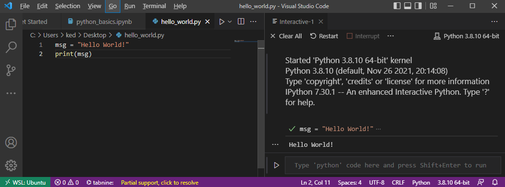

## Recap last Lecture

- from unique words to embeddings :abacus:
  - recontextualized word meaning 
- today's data-driven NLP is both powerful and biased :warning:
  - data is never raw but depends on many decisions

::: notes

- Ziel von NLP: Wörter, Sätze, Dokumente vergleichbar machen
  - Übersetzung, Zusammenfassung, Reasoning erst dann möglich

- Daten haben eine Geschichte
  - Geschichte der Gesellschaft
  - problematisch, wenn einfach "alte Daten" für Training "neuer Systeme" verwendet werden

:::

## Outline

- enter the shiny world of Python :sunglasses:

  - programming basics
  
- get familiar with Visual Studio Code

  

::: notes

- Einstieg in Python erst jetzt
  - Einstieg mit Bash einfacher
  - Konzepte von Pfaden, regulären Ausdrücken etc funktionieren genau gleich

- ziemlich trockener Einstieg in Python
- Grundverständis notwendig für NLP-Analysen

:::


# <span style="color:white;">Python</span> {data-background-image=../images/green_python.jpeg}

## Python is ...

<!-- https://pixabay.com/de/photos/gr%C3%BCne-baumpython-python-baumpython-543243/ -->

:::::::::::::: {.columns}
::: {.column width="60%"}

### a programming language that is...

- general-purpose
  - not specific to any domain
- interpreted
  - no compiling

- very popular in data science

::: 

::: {.column width="40%"}


:::

:::::::::::::: 

::: notes

- viele Sprachen, wie den natürlichen Sprachen auch
  - alle mit ungefähr gleichem Ziel, aber unterschiedlichen Mitteln dahin zu kommen
- Python vs. R
  - Python breiter einsetzbar
  - meiste Tools für DataScience für beide Sprachen

:::


## How to learn Programming?

### Three inconvenient truths :cold_sweat:

- programming cannot be learnt in a course alone
  - I try to make the start as easy as possible!
- frustration is part of learning
  - fight your way!
- the Python ecosystem is huge
  - grow skills by step-by-step

. . .

**Programming can be absolutely captivating! :v:**


::: notes

- Es wäre gelogen zu sagen, Programmieren sei einfach
- Welt des Programmierens ist riesig
  - es gibt mehr Möglichkeiten/Einschränkungen als ich zeigen kann

- vieles wird nicht unmittelbar klar
  - lernen aus Fehlern, wenn sie passieren
- Programmbeispiele sind möglichst kurz / einfach geschrieben
- Es gibt auch Positives
  - unmittelbares feedback
  - tolles Gefühl, wenns klappt
  - selbständiges Lernen ist gut möglich

:::

# <span style="color:#1c1b1b">Wheting your Appetite</span>{data-background-image=../images/scattertext_example.png}

# Programming Concepts & <br>Python Syntax

## Variables

### Variables are kind of storage boxes :gift:

```python
# define variables
x = "at your service"
y = 2
z = ", most of the time."

# combine variables
int_combo = y * y		# for numbers any mathematical operation
str_combo = x + z		# for text only concatenation with +

# show content of variable
print(str_combo)
```


::: notes

- Variablen sind wie Aufbewahrungsboxen, ein Tupperware
  - etwas (Objekte) reinstecken 
  - bei Gebrauch hervorholen
- technisch Wert zuweisen und auf Wert zugreifen
- Namenskonvention von Variablen: Kleinschreibung, English, underscore statt space

:::

## Data Types

### The type defines the object's properties

| Name                 | What for?                               | Type                 | Examples                             |
| -------------------- | --------------------------------------- | -------------------- | ------------------------------------ |
| String               | Text                                    | str                  | `"Hi!"`                              |
| Integer, Float       | Numbers                                 | int, float           | `20`, `4.5`                          |
| Boolean              | Truth values                            | bool                 | `True`, `False`                      |
| <span>&#8942;</span> | <span>&#8942;</span>                    | <span>&#8942;</span> | <span>&#8942;</span>                 |
| List                 | List of items (ordered, mutable)        | list                 | `["Good", "Afternoon", "Everybody"]` |
| Tuple                | List of items (ordered, immutable)      | tuple                | `(1, 2)`                             |
| Dictionary           | Relations of items (unordered, mutable) | dict                 | `{"a":1, "b": 2, "c": 3}`            |


::: notes

- es gibt verschiedene Objekte
- Namen unabhängig von Programmiersprache
- je nach Typ andere Eigenschaften
- der Typ ist immer implizit (dynamisch), nicht angeben bei Zuweisung
- Liste ist eine grosse Box, die kleine Boxen aufnehmen kann
- Tuple ist das gleiche nur kann man nicht mehr ändern an dieser Box, nur reinschauen

:::


## Data Type Conversion

### Combine variables of the same type only

``` python
# check the type
type(YOUR_VARIABLE)

# convert types (similar for other types)
int('100') 	# convert to integer
str(100)	# convert to string

# easiest way to use a number in a text
x = 3
mixed = f"x has the value: {x}"
print(mixed)
```


::: notes

- Analogie: nur gleiche Schachteln können kombiniert werden

:::


## Confusing Equal-Sign

### `=` vs. `==` contradicts the intuition

```python
# assign a value to a variable
x = 1
word = "Test"

# compare two values if they are identical
1 == 2 				# False
word == "Test" 		# True
```


::: notes

- = mit ungewohnter Funktion
- = Zuweisungsoperator
  - in Schule gelernt: Entsprechung linker + rechter Seite
  - R nutzt <-
- == Vergleichsoperator

:::


## Comments

- lines ignored by Python
- write comments, it helps you... :memo:
  - to learn initially
  - to understand later

```python
# single line comment

"""
comment across 
multiple 
lines
"""
```


## Visual Studio Code

### The (best) editor to program in Python

:::::::::::::: {.columns}
::: {.column width="50%"}

- VS Code features
  - interactive programming
  - integrated development environment (IDE)
  - similar to RStudio
- 3 views in editor
  - programming (left)
  - output (right)
  - additional information (bottom)
- use `tab` for autocompletion

:::

::: {.column width="50%"}

](../images/vs_code_hello_world_full.png)


:::

::::::::::::::

::: notes

- demonstration of hello world example
  - run script interactively
  - variable explorer
  - problems in case of wrong syntax
    - rename `msg` to `message`
    - remove `=`
  - tab for completion
  - check for WSL and tabnine support
  - **Pause**

:::

## In-class: Get started for Python {data-background=#3c70b5}

1. Make sure that your local copy of the Github repository KED2023 is up-to-date with `git pull` in your command-line.  
2. Open the Visual Studio Editor.
3. Windows User only: Make sure that you are connected to `WSL: Ubuntu` (green badge lower-left corner, see image on the slide after the next). If not, click on the badge and select `New WSL Window`.

## In-class: Run your first Python Program {data-background=#3c70b5}

1. Create a new file with the following content, save it as `hello_world.py` in the `KED2023` folder. Then, execute it by a right click on the code and select  `Run current file in interactive window`.

   ```python
   # print out a message
   msg = "Hello World!"
   print(msg)
   ```

2. Does the output looks like the screenshot on the next slide? If the execution doesn't work as expected, ask me or your neighbour. There might be a technical issue. 

## In-class: Expected Output {data-background=#3c70b5}

{width=70%}


## Iterations

### for-loop

do something with each element of a collection

```python
sentence = ['This', 'is', 'a', 'sentence']

# iterate over each element
for token in sentence:
    
    # do something with the element
    print(token)	
```

::: notes

- Anwendungsfall
  - für viele Objekte das gleiche machen
- in Bash angeschaut für stapelweise OCR
- sentence + token sind Variablen
  - token ist temporäre Variable (Inhalt ändert sich während Loop)
- in Loop können Operationen durchgeführt werden

:::

## Conditionals

### if-else statement

condition action on variable content

```python
sentence = ['This', 'is', 'a', 'sentence']

if len(sentence) < 3:
    print('This sentence is shorter than 3 tokens')
    
elif len(sentence) == 3:
    print('This sentence has exactly 3 tokens')
    
else:
    print('This sentence is longer than 3 tokens')
```


::: notes

- Anwendungsfall
  - Aktion abhängig machen von Variableninhalt
- Frage: Was wird ausgegeben?
- Funktionen für Länge und Print

:::


## Indentation matters!

:::::::::::::: {.columns}
::: {.column width="50%"}

- intend code within code blocks
  - loops, if-statements etc.
- press `tab` to intend

:::

::: {.column width="50%"}


:white_check_mark:

```python
if 5 > 2:
    print('5 is greater than 2')
```


:x:

```python
if 5 > 2:
print('5 is greater than 2')
```

:::
::::::::::::::

::: notes

- shift + tab für unintend
- tab wird umgewandelt in 4 spaces

:::

## Methods: Create new Objects

### Build your world! :earth_africa:

```python
sentence = 'This is a sentence'

# split at whitespace and save result in new variable
tokens = sentence.split(' ')	

# check the content and type variables
print(sentence, type(sentence), tokens, type(tokens))			
```


::: notes

- Konzept von Objekt hat mit Objektorientierung zu tun
  - für uns ist jede Variable einfach ein Objekt mit bestimmten Typ
- jedes Objekt/Variable stellt bestimmte Methoden zur Verfügung

:::


## Methods: Change Objects

### Depending on the object, you can do different things :hammer_and_wrench:

```python
# add something to a list
tokens.append('.')

# concatenate elements to string
tokens = ' '.join(tokens)
print(tokens, type(tokens))
```


## Functions and Arguments

### DRY: Don't Repeat Yourself

- functions have a name and optional arguments
  - `function_name(arg1, ..., argn)`
- some functions are predefined
  - `print(), len() and sorted()`


```python
def get_word_properties(word): # define function
    """
    Print properties for a word given as an argument.
    """
    length = len(word)
    sorted_letters = sorted(word, reverse=True)
    print(f"{word} has {length} letters ({sorted_letters})".)

get_word_properties('computer')	# call function with any word
```


::: notes

- DRY ist ein Grunprinzip beim Programmieren
- Anwendungsfall
  - Code strukturieren, Redundanzen vermeiden
- zwei Teile: definieren + aufrufen
- Funktion mit vordefinierten Argumenten
- Es gibt auch vordefinierte Funktionen 

:::


## Indexing

### Computers start counting from zero! :dizzy_face:

```python
sentence = ['This', 'is', 'a', 'sentence']

# element at position X
first_tok = sentence[0]		# 'This'

# elements of subsequence [start:end]
sub_seq = sentence[0:3]		# ['This', 'is', 'a']

# elements of subsequence backwards
sub_seq_back = sentence[-2:]		# ['a', 'sentence']
```

::: notes

- Anwendungsfall
  - nur ein Teil der Objekte auswählen

:::


## Errors

### A myriad of things can go wrong :facepalm:

:::::::::::::: {.columns}
::: {.column width="50%"}

1. read the message
2. find the source of the error
   - script name + line number
3. paste message into Google

:::

::: {.column width="50%"}

<!-- https://gifer.com/en/78BJ -->

](../images/google_rubiks.gif)

:::

::::::::::::::

::: notes

- produce NameError, TypeError

:::

## Modules/Packages

### No programming from scratch :tada:

- packages provide more objects and functions
- packages need to be installed additionally

```python
# import third-party package
import pandas
import spacy
import plotnine
```


::: notes

- Standing on the shoulders of giants
- alles auf GitHub

:::


## Jupyter Notebooks

- combine text and code in a single document
  - similar to [R Markdown](https://rmarkdown.rstudio.com/)
- [open in VS Code](https://code.visualstudio.com/docs/datascience/jupyter-notebooks)
- run code with the play button left to the cell or with `CTRL+Enter`


## In-class: Exercises I{data-background=#3c70b5}

1. Open the script with the basics of Python in your Visual Studio Editor:  
   `KED2023/materials/code/python_basics.ipynb`
2. Try to understand the code in each cell and run them by clicking the play symbol left to them. Check the output. Modify some code as well as data and see how the output changes. Initially, this try-and-error is good strategy to learn. Some ideas:
   - Combine a string and an integer variable without converting it. What error do you get? How can you avoid it?
   - Select `is a`  from the variable `sentence` using the right index.

## In-class: Exercises II{data-background=#3c70b5}

1. Write a Python script that

   - takes text (a string)
   - splits it into words (a list)
   - iterates over all the tokens and print all tokens that are longer than 5 characters
   - Bonus: wrap your code in a function.

2. Go to the next slide. Start with some of the great interactive exercises out there in the web.

## Resources

:::::::::::::: {.columns}
::: {.column width="50%"}

### Get more explanations

- [Google's Python Class](https://developers.google.com/edu/python/introduction)
- [Introduction of Python for Social Scientists](https://melaniewalsh.github.io/Intro-Cultural-Analytics/02-Python/04-Variables.html) [@Walsh2021]
- [Official Python introduction](https://docs.python.org/3/tutorial/introduction.html)

:::

::: {.column width="50%"}

### Learn basics interactively

- [Introduction to Python by IBM Cognitive Class](https://github.com/computationalcore/introduction-to-python)
- [LearnPython](https://www.learnpython.org/en/Welcome)


::: 

::::::::::::::

# Questions?{data-background="../images/paint-anna-kolosyuk-unsplash.jpg" .white-text}

## References

