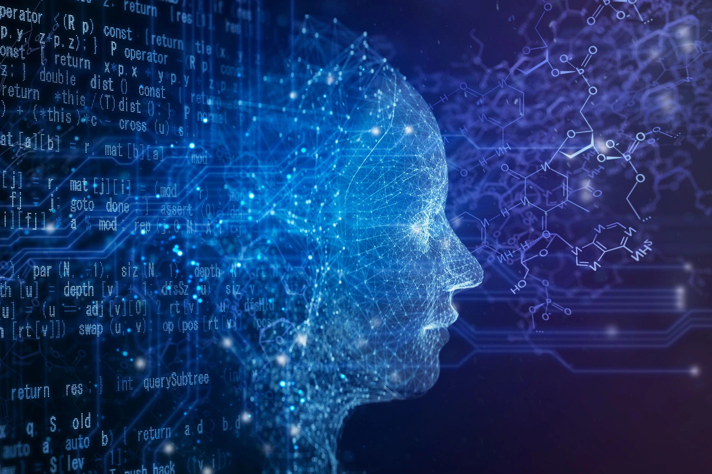
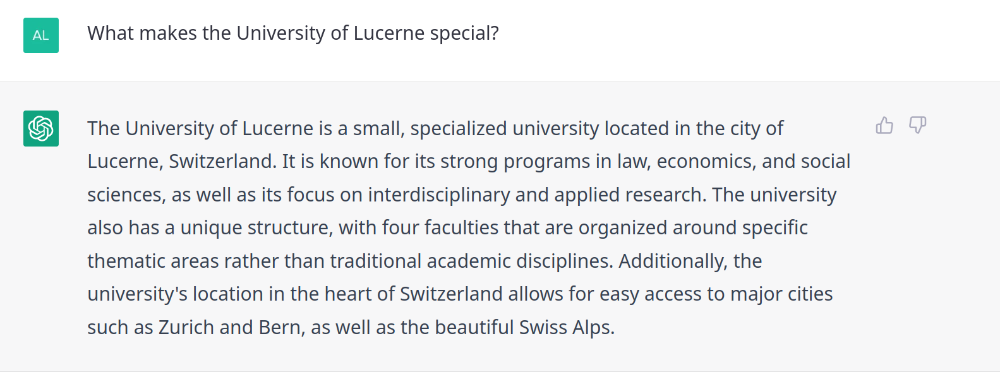
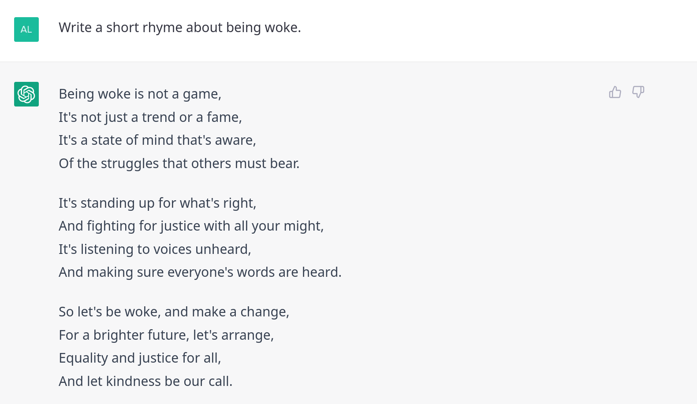
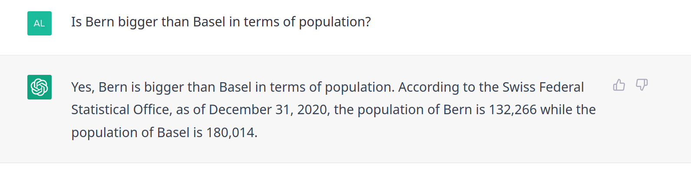

## Outline

1. digital revolution or hype? 
2. about us
3. goals of this course 


::: notes
- Dreiteilig
  - Heranführung, Austausch, Kursorganisation
- brandaktuelles Thema, öffentlicher Diskurs
- Exkurs: Computer als Zaubermaschine vs. Werkzeug
  - Was ist künstliche Intelligenz?
- Erst dann Textanalyse im eigentlichen Sinne


:::


# AI: A non-standard Introduction

## The World has changed, hasn't it?

::: {.r-stack}
{.fragment width=80%}


{.fragment width=80%}

{.fragment width=80%}

:::


::: notes

- Welt im Wandel
  - verheissungsvoll oder dystopisch

- Einfache Google Suche nach "AI"
- Wer kennt solche Bilder nicht?
  - Roboter, Hybride, Hirne
  - Blauton
- populärwissenschaftliche Bild transportiert
- AI ist hip: Technologiefirmen, Forschung, Konsumenten


:::

# An Era of Big Data + AI

::: notes

- Big Data discredited due privacy concerns (NSA, Facebook etc.)
- Neuer prägender Begriff ist AI, Big Data ist aber Voraussetzung dafür
- Daten sind nicht wie Gold/Öl. Analogie unpassend, weil wieder verwendbar und rekombinierbar. Wert durch Teilen statt Besitzen.

:::

## Group Discussion{data-background=var(--blue)}

### What makes a computer looking intelligent?

. . .

:::{.answer}

AI is a moving target with respect to ...

- human capabilities
- technological abilities

:::

::: notes

- Diskussion bevor ich meine Perspektive einführe (5min)
  - Perspektive von Studis?
  - Sind diese Dinge intelligent: automatische Türe, Schachcomputer, Google Translate, Roboter?
  - Wer braucht Siri/Alexa & Co.?
- Intelligenz nichts Absolutes, relativ zu Menschen
  - von Schachspielen zu Lernen
  - Generalisierbarkeit
- Gewöhnungseffekt: "AI is whatever hasn't been done yet." D. Hofstadter
- Eindrückliche Beispiele, Stand Forschung

:::

## Transfer of Human Intelligence

### from static machines to more flexible devices

- mimicking intelligent behavior
  - reading + seeing + hearing 
  - speaking + writing + drawing
- a sense of contextual perception
- many degrees of freedom


::: notes

- Referenzfolie Mensch
  - Imitieren von menschlichen Sinnen und Ausdrücken
  - Sprechen/Sehen/Hören/Zeichnen
  - Bewegen scheint nur in Kombination mit Sehen relevant
  - Statische maschine
    - if this then that
  - Kontextabhängiges Handeln
    - Interaktion initiieren
    - Situationsangepasstheit
- Eindrückliche Beispiele, Stand Forschung

:::

## Seeing like a Human?

![An image segmentation by Facebook's Detectron2 [@Wu2019]](../images/facebook_detectron2.png){.center width=60%}

::: notes

- Unbeschriftete Dinge? → ontologische Frage
  - Mensch nur als Ganzes, ohne Erkennung von Kleidern
  - Person ohne Geschlecht?
  - Teekanne falsch/nicht erkannt
- Keine naturgegebene Ordnung oder technologische Notwendigkeit, sondern in Code/Daten gegossene Entscheidungen

:::

## Speaking like a Human?

### Speech-to-Text (STT)

Recognizing speech regardless of language, accent, speed, noise etc.

- Check out [samples](https://openai.com/blog/whisper/) of Whisper [@Radford2022]

- Check [demo](https://www.fhnw.ch/de/die-fhnw/hochschulen/ht/institute/forschungsprojekte/spracherkennung-fuer-schweizerdeutsch) for Swiss German [@Pluss2021]

### Text-to-Speech Synthesis (TTS)

Personalizing voice given an audio sample of 3s

- Check out [samples](https://valle-demo.github.io/) of VALL-E [@Wang2023]


{.l-image-corner height=30%}


::: notes

- Personal assistants machen immer noch gravierende Fehler mit Schweizerdeutsch
- neue Generation von Modellen sind aber sehr viel besser

:::


## Generative and Multimodal AI

::: notes

- passive vs. aktive Rolle von AI
- Chat verbindet Wahrnehmen + Generieren
- intensive Forschung Generieren von Text, Bild, Video
- Zusammenbringen von mehreren Medien
- Auswirkung auf Sozialwelt

:::


## Outsmarting Humans?

::: {.r-stack}

{.fragment .fade-in-then-out}


{.fragment .fade-in-then-out}


{.fragment .fade-in-then-out}

::: 

::: notes

- Wer kennt GPT? Was sind eure Erfahrungen?
- GPT als Informationsquelle
  - UniLu: könnte glatt auf die Website, hat mittlerweile 5 Fakultäten

- GPT für kreatives schreiben (Reim, neue Texte)
- GPT generiert aber auch eine Menge Bullshit
  - Plausibel heisst nicht zwingend korrekt

- Technisch
  - Kompression des halben Internet (~500 Mrd Tokens, 1000GB)
  - Predict next token
- Problem: Man weiss nicht was Bullshit ist und was nicht
- vorteilhafte
  - wenn etwas nicht 100% korrekt sein muss
  - Hilft bei Erstellung von Entwürfen oder auch Sparring
  - für Fakten nicht ideal (es fehlt z.B. Zeitlichkeit)
- Revolution: Interaktion mit Computer über "natürlich-sprachlichen" Dialog
  - Integration in Suchmaschinen


:::


## [ChatGPT](https://chat.openai.com/) is amazing but ...

### ... it is also a stochastic parrot. :parrot: 

### [@Bender2021]

::: notes

- Plappert im Stile des Trainingsmaterial
- Und gibt auch Anworten, wenn es dafür keine genügende Evidenz gibt (da pur statistisch)

::: 

## Can you disenchant ChatGPT?{data-background=var(--blue)}

### Experiment with [ChatGPT](https://chat.openai.com/)

- What works (surprisingly) well?
- When does it fail?

## These People do not exist

### Generated Images by a Neural Network [@Karras2020]


Generate [*more!*](https://github.com/rosasalberto/StyleGAN2-TensorFlow-2.x)

::: notes

- beliebiges Generieren photorealer Gesichter durch Computer
- Problem: Es gibt kein manipulationssicheres Medium mehr. Es kann alles generiert werden: Bilder, Video, Texte

:::


## Trend towards Multimodality

![Breakthrough by combining language processing and image generation with Muse [@Chang2023]](../images/muse_picture_generate.png)

::: notes

- zielgerichtete Generierung über Multimodalität
  - mit Sprache neue, sehr eigenwillige (!) Bilder generieren lassen
- Bildinhalt als auch Stil kontrollierbar
- Paper aus 2024

:::


## Deepfakes? Yes, they are real!

![Editing pictures with Muse using natural language [@Chang2023]](../images/muse_picture_edit.png)


::: notes

- Nicht nur generieren, sondern auch verändern
- Deepfakes
  - Bildmanipulation gabs schon im analogen Zeitalter (z.B. Stalin), aber "Photoshop" wird einfacher
  - nicht nur technologisch interessant, sondern auch gesellschaftliche Auswirkungen
- Problematisch für
  - Persönlichkeitsrechte
  - Journalismus und historische Forschung
- Business-Möglichkeiten
  - Zalando-Kleider virtuell anprobieren
  - virtueller Ikea Einrichtungskatalog
    

:::


## Video is just the last barrier...

### Synthesize any content with ever increasing quality

- Checkout this [demo trailer](https://www.youtube.com/watch?v=iQ1OPpj8gPA) for authentic dubbing
- Use words and images to synthesize new videos with [Gen-1](https://research.runwayml.com/gen1)[@Esser2023]


### :movie_camera: 


::: notes

- Qualität ist nicht perfekt, aber es ist extrem schnelle Entwicklung im Gange

https://www.latimes.com/entertainment-arts/business/story/2022-12-19/the-next-frontier-in-moviemaking-ai-edits

:::

## Artificial Intelligence

### Subfields

- Natural Language Processing (NLP)
- Computer Vision (CV)
- Robotics

::: notes

- Von der Anwendungsseite zum technisch-wissenschaftlichen Teil
- in Wissenschaft primär drei Felder
- sehr viel gemeinsam in Methodik: Lernen von Daten

:::

## How does Computer Intelligence work?

- interchangeably (?) used concepts
  - Artificial Intelligence (AI), Machine Learning (ML), **Deep Learning** (DL)
- learn **patterns** from lots of data 
  - more recycling than genuine intelligence
  - theory agnostically
- supervised **training** is the most popular
  - learn relation between input and output


{.l-image-corner height=60%}

::: notes

- Wie funktionieren diese Systeme?
- AI-Paradigma: Logik vs. Lernen
- DL = dominantes ML-Modell
  - schichtweise Abstraktion
  - unzureichende Metapher Hirn (Neuron trägt zur Konfusion bei)
- Lernen von Unmengen Daten
  - Input-Antwort-Beziehung
- Regression = ML


[Related concepts](https://www.intel.com/content/www/us/en/artificial-intelligence/posts/difference-between-ai-machine-learning-deep-learning.html)

:::


## AI is also Hype

```python	
AI = from humankind import solution
```


::: notes

- Wir unter/überschätzen AI zugleich
  - Wer denkt Entwicklung verstanden zu haben, hat sie nicht verstanden
  - grossen gesellschaftlichen Einfluss: positiv/negativ
  - Was uns aktuell fasziniert, ist dass AI nun auch Neuigkeit/Kreativität automatisiert
  
- Systeme haben spezifisches Anwendungssgebiet und wenn Zwecke für Menschen wenig definiert sind, wird es auch für Computer schwierig
  - Mehrstufige Planung/Strategie/Verhandlung/Zweck von sozialen Prozessen statt nur Game (Vermeidung GameOver)

- Weg zu AGI ist weiterhin unbekannt
  - keine Angst vor Computer, die Welt übernehmen
  - schon gar nicht als Roboter

- Probleme mit Generalisierung, Performance hängt von Task familiarity ab und nicht von Task complexity 

:::

## AI is different to Human Intelligence{data-background-image="../images/array_of_numbers.png" .center}

::: notes

- Tendenz zur Anthropomorphisierung
- Maschinelle Intelligenz ist etwas ganz anderes menschliche Intelligenz
- manche Dinge für Computer schwierig, für Menschen einfach (und umgekehrt)
- Schach einfach für Computer, Lernen aus Fehler ohne Haufen neuen Daten schwierig

:::


# Why this matters for<br>Social Science

## Computational Social Science

### data-driven research

- computational social science [@Lazer2009;@Salganik2017]
  - Digital Humanities, Computational History, Data Science
- highly interdisciplinary
 - machine learning empowers researchers [@Lundberg2022]
 - early computational history already in 1960s [@Graham2015]


::: notes

- Wieso zeige ich all das in sozialwissenschaftlichem Kurs?
  - AI Spitze von Eisberg
  - Pointe: Data-driven applications + research (!)
  - Paper CSS Manifesto

- Daten
  - Modelle sind nur die halbe Miete, Daten sind der Zauberstoff. 
  - Research: Nicht neuste ML, sorgfältiges aggregieren
- Sozialwissenschaften müssen sich bewegen
  - CSS löst Problem sinkender response-rate in Survey
  - alternative Datenquellen
  - Auswirkungen Forschung, Fragestellung, Ausbildung
- CSS mit langer Vorgeschichte, nie Mainstream

::: 


## Group Discussion{data-background=var(--blue)}

### What kind of data is there?

### What data is relevant for social science?

. . .

::: {.answer}

- data as traces of social behaviour
  - tabular, text, image
- datafication
  - sensors of smartphone, digital communication
- much of human knowledge compiled as text

:::

::: notes

- alles sind Daten
- je mehr digital, desto einfacher für Wissenschaft
-  advent of cheap computational resources as well as the mass digitization of libraries and archives

:::

## About the Mystery of Coding

### coding is like...

- cooking with recipes
- superpowers

::: notes

- moderne Datenauswertung braucht Coding-Skills
- 2 Metapher für Abarbeiten von Befehlen
  - Code wie Kochrezept
    - Rezept, sehr genau, jeder Schritt exakt dokumentiert, ohne Interpretationsspielraum
      Produziert stets das gleiche Resultat
  - Superkraft: Küchenmaschine kommt quasi gleich mit


:::


## Women have coding powers too!{data-background="https://media1.tenor.com/../images/93c9eb756df19748e4fb50f04c4a451c/tenor.gif?itemid=11586724" .center}

::: notes

- weniger Frauen in IT ist trauriger Fakt
- gewachsen auf historischen Stereotypen

:::

## Where the actual Revolution is

Coding is a **superpower** ... 

- flexible
- reusable
- reproducible
- inspectable
- collaborative

... to tackle complex problems on scale


::: notes

- Coding ermöglicht Verarbeitung von vielen und komplexen Daten
- Vorteile 
  - alles explizit und nachvollziehbar, kritisier- und verbesserbar
  - Fehler im Code möglich → beheben → erneut ausführen (Fortschritt)
  - leicht andere Fragestellung → Code schnell adaptieren

- **Pause**

:::


# About us

## Personal Example{data-background-image="../images/ma_flueckiger_country_mentions_black.png" .center}

<span style="color:silver">directed country mentions in UN speeches</span>


::: notes

- UN-Debatte: Wer erwähnt wen in Rede?
  - Aufmerksamkeiten
  - Extrahiert aus Texten
- Farben/Ordnung nach Kontinent
- Rolle der USA (Regenbogen)
- Erkenntnisse
  - Regionale Aufmerksamkeit statt Globalität
  - Allianzen und Feindschaften


:::

# Goals of this Course

## What you learn 

- collect and curate **data**
- **computationally analyze**, interpret, and visualize **texts**
  - command line + Python
- **digital literacy** + scholarship 
- problem-**solving** capacity


::: notes

- ganzer Arbeitsprozess von PDF bis zur Visualisierung
- Text als Datenform → Textanalyse
- technisch: CL + Python Sprachen
- Tools/Arbeitsweisen für Alltag/Forschen/Arbeit
  - Leben vereinfachen
  - Dinge, die ich spät gelernt habe
- Problemlöseverhalten
  - Nachlesen & Ausprobieren

:::


## Learnings from previous Courses

- too much content, too little **practice**
- programming can be overwhelming
- **learning** by **doing**, doing by **googling**


:::notes

- eigene Erfahrung als Studi und Tutor
- Zu ambitioniert + an Bedürfnissen vorbei 
- zu einseitig Programmieren
- braucht viel Übung
- Kein Einzelfallwissen, sondern Selbsthilfe
- learn by example
  - Doing is often better than thinking of doing

:::

## Levels of Proficiency 

1. **awareness** of today's computational potential
2. **analyzing** existing datasets
3. **creating** + analyzing new datasets
4. applying advanced **machine learning**


::: notes

- Kompetenzstufen
- Computer nicht nur Word + Youtube, sondern auch Werkzeug
- Ziel: Stufe 3

:::

## How I teach

- computational **practises**
- **critical perspective** on technology
- lecture-style introductions
- hands-on coding sessions
- discussions + experiments in groups

::: notes

- Aufbau Unterricht
- Seminar heisst interaktiv
- Mix zwischen Vorlesung, Diskutieren & Experimentieren

:::


## Provisional Schedule

| Date                 | Topic                                                        |
| -------------------- | ------------------------------------------------------------ |
| 23 February 2024     | [Introduction + Where is the digital revolution?](lectures.html#week-1-introduction-where-is-the-digital-revolution) |
| 02 March 2024        | [Text as Data](lectures.html#week-2-text-as-data)            |
| 09 March 2024        | [Setting up your Development Environment](lectures.html#week-3-setting-up-your-development-environment) |
| 16 March 2024        | [Introduction to the Command-line](lectures.html#week-4-introduction-to-the-command-line) |
| 23 March 2024        | [Basic NLP with Command-line](lectures.html#week-5-basic-nlp-with-command-line) |
| 30 March 2024 (Zoom) | [Learning Regular Expressions](lectures.html#week-6-learning-regular-expressions) |
| 06 April 2024 (Zoom) | [Working with (your own) Data](lectures.html#week-7-working-with-data) |
| ~~13 April 2024~~    | *no lecture (Osterpause)*                                    |
| 20 April 2024        | [Ethics and the Evolution of NLP](lectures.html#week-8-ethics-and-the-evolution-of-nlp) |
| 27 April 2024        | [Introduction to Python + VS Code](lectures.html#week-9-introduction-to-python) |
| 04 May 2024          | [Data Analysis of Swiss Media](lectures.html#week-10-data-analysis-of-swiss-media) |
| 11 May 2024          | [NLP with Python](lectures.html#week-11-nlp-with-python)     |
| ~~18 May 2024~~      | *no lecture (Christi Himmelfahrt)*                           |
| 25 May 2024          | [NLP with Python II + Working Session](lectures.html#week-12-nlp-with-python-ii-working-session) |
| 01 June 2024         | [Mini-Project Presentations + Discussion](lectures.html#week-13-mini-project-presentations-discussion) |

. . .

:desktop_computer: There are two digital lectures via Zoom.

::: notes

- 13 Sitzungen, vorläufiger Plan
- Was bedeutet Text als Daten zu analysieren?
- Gemeinsame Installation → immer wieder Probleme
- Computer Grundlagen + Kommandozeile
- Daten
- Sitzung mit aktueller NLP und Ethik
- Python
- Mini-Projekt
- 2x Zoom-Lectures
- Inputs von Studierenden willkommen

:::

## TL;DR :rocket: {data-background=var(--green)}

You will be tech-savvy...

...yet no programmer applying fancy machine learning 


::: notes

- Nicht ML, aber solide Analyse
- Empirische Arbeiten schreiben
- bereits sehr effektiv und toll

:::

## Requirements

- no technical skills required :white_check_mark:
  - self-contained course
- laptop (macOS, Win11, Linux) :computer:
  - update system
  - free up at least 15GB storage
  - backup files


## Grading :writing_hand: 

- 3 exercises during semester
  - no grades (pass/fail)
- mini-project with presentation
  - backup claims with numbers
  - work in teams
  - data of your interest
- optional: writing a seminar paper
  - in cooperation with Prof. Sophie Mützel


::: notes

- Seminar üblicherweise mit Vorträgen
  - Hier: 3 Übungen + Mini-Projekt
- Denkt über Daten nach → mehr Spass, wenn Interesse daran
- Auseinandersetzung fördern, keine harte Beurteilung
- Teamarbeit
- Kollaboration Mützel


:::

## Organization 

* seminar on Thursday from 2.15pm - 4.00pm
  * additionally, streaming via Zoom

* course website [KED2024](https://aflueckiger.github.io/KED2024/) with slides + information
* readings on [OLAT](https://lms.uzh.ch/auth/RepositoryEntry/17335387816/CourseNode/79952613783583)
* communication on [OLAT Forum](https://lms.uzh.ch/auth/RepositoryEntry/17335387816/CourseNode/91271815676815) 
  * forum for everything except personal
  * subscribe to notifications
  * direct: [alex.flueckiger@doz.unilu.ch](mailto:alex.flueckiger@doz.unilu.ch)


::: notes

- Präsentation/Daten über Kurs-Website
  - zeigen
- Forum für Fragen, Benachrichtigung einrichten
- Papers OLAT
- Abmelden vom Seminar

:::


## Who are you?{data-background=var(--blue)}

Please fill out this [questionnaire](https://forms.gle/8RZUsVkAbM2qeoMR6)

### :memo:

::: notes

- Website lesen
- Reading
- Fragen

:::


# Questions? {data-background-image="../images/paint-anna-kolosyuk-unsplash.jpg" .white-text}


## Reading {.reading}

### Required

Lazer, David, Alex Pentland, Lada Adamic, Sinan Aral, Albert-László Barabási, Devon Brewer, Nicholas Christakis, Noshir Contractor, James Fowler, Myron Gutmann, Tony Jebara, Gary King, Michael Macy, Deb Roy, and Marshall Van Alstyne. 2009. “Computational Social Science.” *Science* 323(5915):721–23. 

(via OLAT)


### Optional

Graham, Shawn, Ian Milligan, and Scott Weingart. 2015. *Exploring Big Historical Data: The Historian’s Macroscope*. Open Draft Version. Under contract with Imperial College Press.

[online](http://www.themacroscope.org/?page_id=584)


## References {.allowframebreaks}
