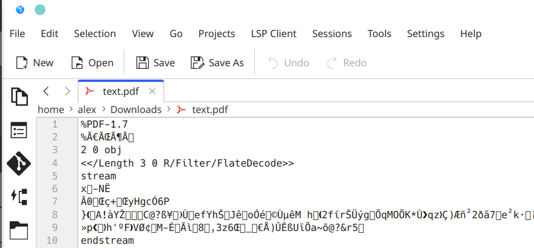
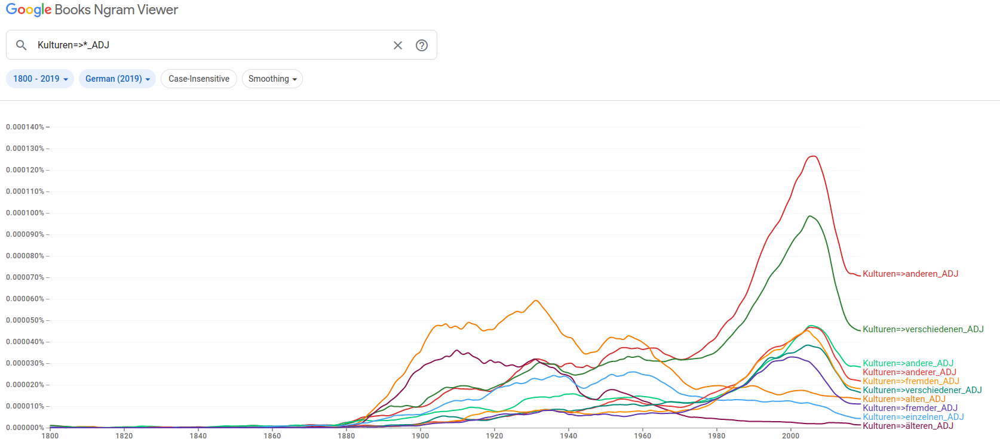

## Outline

-   recap last lecture
-   questions assignment
-   methodological foundation :grimacing:
-   first computational text analysis

::: notes
-   Assignement
-   Fragen zu Inhalt/Website?
-   Diskussion letzte Sitzung + Paper
-   Hauptteil: Bedeutung/Grundlage von Textanalyse
    -   Auf welcher methodischen Grundlage steht das Feld?
    -   Qualitativer Anteil gegenüber letzten Sitzung herausheben
-   zweite Lektion: erste Textanalyse
    -   einfach, aber mächtig
:::

## Recap last Lecture

::: columns
::: {.column width="50%"}
### computer as ...

-   ... an intelligent device
-   ... a tool for a *new* social science
:::

::: {.column width="50%"}
### datafication

-   abundance of data
-   exploit new form of data
:::
:::

::: notes
-   Technologie verändert Welt. Seit immer (Feuer, Strom, AI etc.). Erneut grosser Schritt nach Industrialisierung.
    -   wie verändert sich das Soziale/Ökonomische (Wissenschaft, Arbeit, Jobmarkt, Benachteiligung)?
    -   Entwicklung kaum einzuschätzen
-   Computer als Werkzeug für CSS und Datenverarbeitung
    -   Daten wichtiger als Art des ML-Modells
-   Daten (fast) grenzenlos
    -   Eine durchdigitalisierte Welt produziert extreme Menge an Daten, vieles quasi-beiläufig
    -   erst Programmieren ermöglicht Auswertung
:::

## Semiotic Triangle

::: columns
::: column
### Loose coupling between

-   World
-   Cognition
-   Language
    -   synonyms, ambiguity
:::

::: column
![Semiotic Triangle [@Ogden1923]](../images/ogden_semiotic_triangle.png)
:::
:::

::: notes
-   Was ist Sprache?
    -   Keine Philosophie-Vorlesung
    -   Versuch der Einheit: Ding, Konzept und Wort
    -   jede Ecke kann wechseln
-   konkretre Terminologie nicht wichtig, aber das zugrundeliegende Problem ist auch technisch von Bedeutung
-   keine 1:1 Beziehung zwischen Wort/Symbol & Gegenstand
    -   fehlende Eineindeutigkeit ist schwierig für Computer (anders als Datenbank)
        -   identische Personen- und Ortsnamen
        -   umfasst Früchte auch Hülsenfrüchte?
    -   Gleiches heisst anders, anderes heisst gleich
:::

## 

> Language shapes the way we think,   and ~~determines~~ what we can think about.
>
> <cite>Benjamin Lee Whorf</cite>

::: notes
-   zweiteilige These umstritten (Sapir-Whorf-Hypothese)
    -   Inuit-Anekdote zu Schnee bedingt durch Morphologie
    -   Sprache formt das Denken
    -   keine Determination, aber überragende Bedeutung für das Soziale
-   Aktuelles Beispiel: Ukraine-Krieg
    -   Konflikt vs Krieg (Gewalt) vs Invasion (asymmetrisch), militärische Operation (kleinreden)
    -   Definitionskampf um Begriff (und dazugehörige Symbolik)
-   Sprache ist das Soziale schlechthin
    -   Vermittlungsmedium
    -   weitere Formen: Zeichnen, Mathematik, Fotos
-   wenn nicht kommuniziert, dann gesellschaftlich ohne Bedeutung (aber nicht unbedingt unvorstellbar)
    -   Wörter sind Unterscheidungen
    -   Link zu Luhmann
:::

# Working with Texts

## A micro and macro Perspective I

### Identifying trends beyond individual cases

::: columns
::: column
{height="10cm"}
:::

::: column
![Distant reading to analyse trends across texts [@Moretti2000]](../images/nlp-natural-language-processing.jpg){height="10cm"}
:::
:::

::: notes
-   Nun klar, wieso Textanalyse wichtig, aber welche Herangehensweise?
-   Traditionell
    -   Inhaltsanalyse, close reading
    -   Einzeldokumente
    -   lange Zeit alternativlos
-   computergestützte Textanalyse
    -   NLP, distant reading
    -   Textsammlungen
-   Rauszoomen bringt mehr/neues Verständnis, nicht nur Reinzoomen
:::

## A micro and macro perspective II

### Scale leads to abstraction

::: columns
::: column
{height="10cm"}
:::

::: column
{height="10cm"}
:::
:::

::: notes
-   je Approach ein Problem
    -   close: nicht skalierbar
        -   ist das generalisierbar?
    -   distant: kontextlos, da Narrativ/Einzelheiten verloren gehen
        -   verlieren wer/was/wo/wie/wann/warum
        -   was bedeuten Zahlen? Verweis: BIP (informelle Wirtschaft)
-   Methodik ändert evtl. Fragestellung
    -   NLP: nicht Individuum, sondern Diskurs/Gesellschaft/Gruppe
    -   strukturelle Beschreibungen und Kultur/Stimmung
:::

## From micro to macro :bar_chart: ...and back again :bookmark_tabs: {data-background="var(--green)"}

::: notes
-   Lösung: Vogelperspektive, dann Eintauchen und zurück
-   Gute Data Science bedingt gute Kenntnis von Daten
-   Grösser nicht immer besser
:::

## Two Research Paradigms

### data exploration vs. hypothesis testing [@Grimmer2021]

-   add nuance
-   develop new narratives
-   verify hypothesis

::: notes
-   genauere Einordnung: exaktere Epochenbestimmung
-   Agnostik/Induktion ausnutzen für anderes Narrativ
    -   data-driven Diskurs ordnen
-   Modelvorhersagen zu Kausalitätsaussagen
    -   z.B. Klimawandel Berichterstattung -\> Erfolg grüne Partei?
    -   Metadaten zu Kommunikationsflüssen nötig
:::

------------------------------------------------------------------------

## Numbers do not talk  :no_mouth: {data-background="#4d7e65"}

. . .

Thus, quantification and qualitative analysis go well together.

::: notes
-   alter Konflikt Quali/Quanti
    -   beide Lager kritisch gegenüber NLP
    -   zu wenig rigoros, zu naiv mangels Kontext
-   Zahlen sprechen nicht für sich selbst
-   komplementär
:::

## Text as Data

### Text is challenging for computers due to

-   synonymy
-   ambiguities
-   compositonality of meaning
-   discrete symbols
-   unstructured, messy data

[see also @Grimmer2013]

::: notes
-   Link zu semiotischem Dreieck
-   Text inhärent schwierig
    -   herausfordernste Datenform
    -   Front der AI
-   Wörter = diskrete Symbole
    -   nominales Skalenniveau
-   synonymy: Haus vs. Gebäude
-   ambigous: Bank (Finanzinstitut vs. Parkbank)
-   compositional
    -   grosse Mäuse, kleine Elefanten
-   unstrukturiert
    -   anders als Tabelle/Datenbank
    -   unterschiedliche Datenformate
:::

## Unstructured Text? :thinking:

### Collection \> Documents \> Paragraphs \> Sentences \> Words
 

# Data Formats

## In-class Task: File Types {data-background="#3c70b5"}

::: {.columns .blockstyle}
-   What file formats do you know?
-   Open files of different types in a text editor.   Which ones look good?
:::

::: notes
-   Problem ist nicht wirklich der Text, sondern das Format
-   alle möglichen Filetypen, nicht nur Text
    -   zip/tar, exe, dmg/iso, jpg/png/gif
-   Editoren
    -   macOS: TextEdit
        -   Textedit zeigt auch docx problemlos an
    -   Windows: Notepad
-   Dateiendungen aktiviert auf Computer?
:::

## File Formats

-   any filename consists of name + suffix (data type)
    -   e.g. `task.txt`
-   machine-readability
    -   raw: `.txt .csv .tsv` ...
    -   formatted: `.docx .pdf .html .xml` ...
-   open vs. proprietary
-   digital sustainability

::: notes
-   Google, wenn noch nicht aktiv: Mac/Windows show file suffix
-   am besten raw + open
-   Papier altert langsamer als Software!
-   show other formats: csv txt
:::

## File Management :pray:

### Use meaningful names

-   no spaces/umlauts
    -   only: alphanumeric, underscore, hyphen, dot
-   versioning using date
    -   e.g. `task_20240229.pdf` instead of `task_new_final.pdf`

::: notes
-   neben Format ist Bennung zentral
-   Konventionen helfen Fehler vermindern, Verständnis verbessern
-   Version, wenns gebraucht wird
-   **Pause**
:::

# Let's Dive into it! :sweat_drops:

## Counting ngrams

### [Google Ngram Viewer](https://books.google.com/ngrams) [@Michel2011]

-   historical perspective with ngrams
-   \>5.2 million books
-   rise and fall of cultural ideas and phenomena

::: notes
-   Google Books
    -   indexiert ganze (Uni-)Bibliotheken
    -   in 2009 mehr als 4% aller veröffentlichter Bücher
-   See how ideas evolve/change over time
-   y: relative Worthäufigkeiten
-   x: Bücher indexiert nach Publikationsjahr
-   publiziert in Science, kein klassiches SoWi Journal
    -   disziplinare Grenzen brechen auf
:::

## In-Class Task: Investigate the Environmental Discourse {data-background="#3c70b5"}

-   What other terms have been used to describe nature?

    -   e.g. environment

-   What environmental issues are debated the strongest? When?

    -   e.g. nuclear power plant

-   Are there any differences between languages? Between corpus versions?

    -   i.e. similar words with non-equivalent curves over time

### :dart: What do you conclude from your observations?

::: notes
-   Dauer: 20 Minuten
-   issues described by whom?
-   Herumgehen + selbst ausprobieren
-   Wikipedia nutzen
:::

## Refine your Queries

### Check out case-sensitiveness, wildcards (\*) ​an​d ​operators :nerd_face:
 

| Operator | Description                                                                                                                                                           |
|-------------------|-----------------------------------------------------|
| `+`      | sums multiple expressions to **aggregate trends**.                                                                                                                    |
| `-`      | subtracts an expression from another to **measure one ngram relative to another**.                                                                                    |
| `/`      | divides the expression by another one for **isolating the behavior of an ngram with respect to another**.                                                             |
| `*`      | multiplies the expression by a number to compare ngrams of very different frequencies. (Enclose the ngram in parentheses so that \* isn't interpreted as a wildcard.) |

## The Raise of the Ngram **pay attention**

::: notes
-   major shift: "call attention" -\> "pay attention"
-   externer Faktor (call) vs. aktives Verhalten (pay)
-   pay attention as a form of currency
-   Zusammenhang? Aufmerksamkeitsökonomie, Individualismus
-   "if you don't want to call attention to yourself by giving an incorrect answer, then you should probably pay attention in class."

Ich höre/verstehe dich: https://books.google.com/ngrams/graph?content=Ich%20h%C3%B6re%20dich%2Cich%20sehe%20dich%2Cich%20verstehe%20dich&year_start=1800&year_end=2019&corpus=31&smoothing=3&case_insensitive=true&direct_url=t4%3B%2CIch%20h%C3%B6re%20dich%3B%2Cc0%3B%2Cs0%3B%3BIch%20h%C3%B6re%20dich%3B%2Cc0%3B%3Bich%20h%C3%B6re%20dich%3B%2Cc0%3B%3BIch%20h%C3%B6re%20Dich%3B%2Cc0%3B%3Bich%20h%C3%B6re%20Dich%3B%2Cc0%3B.t4%3B%2Cich%20sehe%20dich%3B%2Cc0%3B%2Cs0%3B%3BIch%20sehe%20dich%3B%2Cc0%3B%3Bich%20sehe%20dich%3B%2Cc0%3B%3BIch%20sehe%20Dich%3B%2Cc0%3B%3Bich%20sehe%20Dich%3B%2Cc0%3B.t4%3B%2Cich%20verstehe%20dich%3B%2Cc0%3B%2Cs0%3B%3BIch%20verstehe%20dich%3B%2Cc0%3B%3Bich%20verstehe%20dich%3B%2Cc0%3B%3BIch%20verstehe%20Dich%3B%2Cc0%3B%3Bich%20verstehe%20Dich%3B%2Cc0&authuser=0
:::

## The Raise of the Ngram **different culture**

::: notes
-   Anfang der 80er Aufstieg des Konzepts Kultur wie wir es heute kennen (primär nationale Kultur)

-   Patterns EN

    -   dessert=\>\*\_ADJ
    -   \*=\>public_ADJ
    -   \*=\>personal_ADJ

-   Pattern DE

    -   Kulturen=\>\*\_ADJ
    -   Kinder=\>\*\_ADJ
:::

## Remember :thumbsup: {data-background="#4d7e65"}

Has the language evolved over time or the social perception?

. . .

 

**Likely both.**

Similarly, language may vary across regions and communities.

::: notes
-   Grosse Frage ist
    -   Wird das gleiche anders benannt?
    -   Geht es um was anderes?
-   Link zu Odgen Dreieck von nicht fixer Beziehungen
:::

# No Culturomics but meaning-making

## Phenomena in collective memory

-   semantic drifts (meaning)
-   lexical shifts (frequency)

**Read, read, read** to complement **stats** with context!

::: notes
-   Änderung von kontextueller Verwendung oder Wortfrequenz

-   Bspw.: Eigentum hat sich etabliert, Religion verliert an gesellschaftlichem Stellenwert
:::

## Questions of Interpretation

## Possible reasons of decreasing frequency

-   loosing interest
-   becoming an established fact
-   new reference
    -   `The Great War` → `World War I`
-   selection of data sources

::: notes
-   numbers don't talk
-   Kommunikation
    -   Weisse Schafe nicht erwähnenswert, nur schwarze
    -   Nachrichtenwerte
    -   Themenkonjunkturen
-   einzelne Wörter bilden schlechte Evidenzbasis
:::

## Interacting with Data

### It is a lense, not a map.

::: notes

-   Lens / transformation like biology/physics
    -   allerdings keine Labordaten
    -   Soziales ohne all-else-equal / ceteris paribus
-   not just mapping but interacting
    -   Daten erlauben neue Sicht
    -   deshalb nicht CS überlassen
:::

## A Word of Caution {data-background="#b5533c"}

### The unknowns of Google Ngram Viewer

-   index of books
    -   genre, authors, quantity
-   artifacts of digitalization

:nerd_face: use better alternative: [bookworm HathiTrust](https://bookworm.htrc.illinois.edu/develop/)

::: notes
-   Google: \~4% of all books ever published
-   Compared to the 2009 versions, the 2012 and 2019 versions:
    -   more books, improved OCR, improved library and publisher metadata.
    -   in 2019 much more fiction (e.g. her eyes)
    -   ngrams across page boundaries, no ngrams across sentence boundaries
    -   rule-based tokenization
-   genügt wissenschaftlichem Standard nicht
    -   <https://twitter.com/benmschmidt/status/1419497587296571395>
-   HathiTrust
    -   curated collection
    -   filter by meta data
:::

# Research in practice means organizing {.white-text data-background-image="../images/puzzle_unsplash.jpg"}

::: notes
-   Daten, Analyseentscheidungen und Interpretation müssen alle organisiert werden
-   Wissenschaft auch praktische Seite, nicht nur theoretische
    -   chaotisch statt strukturiert (aufgeräumte Papers kommen erst ganz am Ende)
    -   Organisation von Komplexität als Problem
:::

## The Zen of organizing

### How a computational approach helps

-   code as documentation allowing for criticism :memo:
-   efficient automation :recycle:
    -   "don't repeat yourself"
-   less error-prone :woman_facepalming: :man_facepalming:
-   reproducible :100:

::: notes
-   Reproduzierbarkeit ist Arbeitsgrundlage und höchster Wert (mehr noch als Wahrheit)
    -   Wiederverwendung von Code/Datensatz + Literatur/Theorien
-   Wieso computational approach?
    -   Reproduzierbarkeit und Kritisierbarkeit garantiert
    -   Automatisierung von repetitiven Aufgaben -\> spart Zeit
-   Code strukturiert/dokumentiert Arbeitsablauf/Entscheidungen unzweideutig
    -   gegen Vergessenheit
    -   schützt nicht vor Fehler, aber sichert inkrementellen Fortschritt
-   wichtig für grössere Projekte + Abschlussarbeiten
-   kurzfristig langsamer, langfristig effizienter
    -   keine mühsame Fehlersuche, Wiederholung

[image-src](https://unsplash.com/photos/3y1zF4hIPCg)
:::

## Prepare your System

1.  backup files + update system :construction:
2.  start installation with this [guide](https://aflueckiger.github.io/KED2024/materials/installation_guide.pdf) :construction_worker:

::: notes
-   Nicht riskanter als anderes. Ein Backup gehört dazu, ein Datenverlust sicher nicht.
-   Unklarheiten/Probleme unbedingt zurückmelden
-   Wer hat Python schon installiert? Welches OS/Installer?
:::

## Reading {.reading}

### Required

Lazer, David, Alex Pentland, Lada Adamic, Sinan Aral, Albert-László Barabási, Devon Brewer, Nicholas Christakis, Noshir Contractor, James Fowler, Myron Gutmann, Tony Jebara, Gary King, Michael Macy, Deb Roy, and Marshall Van Alstyne. 2009. “Computational Social Science.” *Science* 323(5915):721–23.

(via OLAT)

### Optional

Graham, Shawn, Ian Milligan, and Scott Weingart. 2015. *Exploring Big Historical Data: The Historian’s Macroscope*. Open Draft Version. Under contract with Imperial College Press.

[online](http://www.themacroscope.org/?page_id=584)

# Questions? {.white-text data-background-image="../images/paint-anna-kolosyuk-unsplash.jpg"}

## References