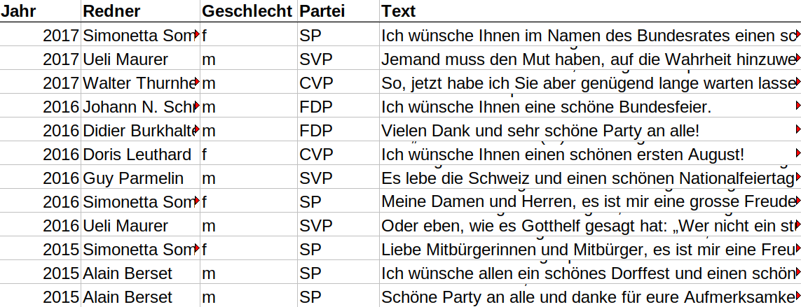

## Recap last lecture

-   perform shell commands
    -   navigate filesystem :evergreen_tree:
    -   create/copy/move/remove files :joystick:
    -   pipe output into other command :fast_forward:

::: notes
-   Einstieg in Shell
    -   Verzeichnisbaum ist nicht nur Metapher, sondern auch technisch Begriff
    -   Erstellen von Files/Ordner
    -   Piping für komplexere Operationen
-   letztes Mal inhaltliche Zumutung, heute erste inhaltlich interessante Analysen
-   Pfade sehr wichtig
-   Übungen ok? technische Fragen?
:::

## Outline

-   performing corpus linguistic using the shell​ :knife:
    -   counting, finding, comparing​​
-   analyzing programmes of Swiss parties :bar_chart:

::: notes
-   Frequenzanalysen = Schweizer Taschenmesser
    -   äusserst effektiv trotz methodischer Einfachheit
-   Ziel: mehr Übungszeit
-   Syntax nicht merken, Wichtiges werdet ihr schlussendlich erinnern
:::

## When politics changes, <br>language changes.

)](../images/swiss_party_politics.gif)

::: notes
-   Motivieren der heutigen Sitzung
-   Positionierung Parteien im politischen Raum über Zeit
-   Gleiche Parteien, aber neue Ziele und Positionierung. Also doch nicht so gleich!
-   Wie erkenne ich semantische Veränderungen?
    -   hier: Abstimmungsparolen von Parteien ausgewertet
    -   Welche Ziele/Ideologien stehen dahinter? --\> Texte fundamental
-   Wenn Politik ändert, ändert sich Sprache
    -   oder gerade umgekehrtes zeitliches Verhältnis / Kausalität
    -   in Politik werden Narrative erprobt

Quelle: https://swissvotes.ch
:::

## How to process a Text Collection

1.  each document as individual file ​(​`​.​t​x​t​`​)​
    -   use shell for quick analysis
2.  a dataset of documents (`.csv`, `.tsv`, `.xml`)
    -   use Python for in-depth analysis

::: r-stack
{.fragment .fade-out}

{.fragment .current-visible height="8cm"}
:::

::: notes
-   Datenextraktion und -zusammenstellung kann mehrstufiger Prozess sein
-   Start oft via Kommandozeile, dann Auswertung in Python
    -   PDF müssen noch umwandelt werden
    -   txt-files erste Stufe bei Datensatzerstellung
-   Daten existieren viele, Datensätze eher wenige
-   sobald strukturierte Daten (Datensatz) -\> Analyse in Python, da sehr viele Tools vorhanden
    -   Bei tsv/csv-file je Zelle ein Dokument, in gleicher Zeile auch noch Metadaten
-   vorerst arbeiten wir nur mit txt files
    -   fördert auch Verständnis
:::

# Counting Things {.white-text data-background-image="../images/counting_blackboard.jpg"}

## Measuring Relevance by Frequency

### Bag of words approach

::: columns
::: {.column width="60%"}
-   counting words regardless of context
-   simple (and simplistic)
-   powerful
-   fast
:::

::: {.column width="40%"}

:::
:::

::: notes
-   Häufigkeit deutet auf eine Form von Relevanz hin
-   in Häufigkeitsanalyse sind Worte kontextlos
    -   BoW = Sack mit Wörtern
    -   Approach schmerzt aus sozialwissenschaftlicher Perspektive
    -   Verlust Ambiguitäten/Negationen
    -   Nachteil der radikalen Vereinfachung (einfaches Zählen) = auch grösster Vorteil
-   Luhmann: ob über etwas gesprochen wird, ist noch wichtiger als das wie
-   ähnlich wie Google Ngram, aber eigene Daten
-   Übersicht von besseren Methoden nach Osterpause
:::

## Get Key Figures of Texts

``` bash
wc *.txt    # count number of lines, words, characters
```

::: notes
-   zuerst Charakterisierung Datenquelle, nicht nur Inhalt
-   Zahlen für einzelne Dokumente und aggregiert auf Sammlung
:::

## Get all Word Occurrences

### Show phrase in context

``` bash
egrep -ir "data" FOLDER/    # search in all files in given folder

# common egrep options:
# -i            search case-insensitive
# -r            search recursively in all subfolders
# --colour      highlight matches
# --context 2   show 2 lines above/below match
```

::: notes
-   options
    -   ignore case
    -   recursive / specific files
-   egrep -ir "data" KED2024/lectures/md/
-   Dateinamen als Filter benutzen
    -   Quelle/Jahr
    -   egrep -ir "data" KED2024/lectures/md/\*md
:::

## Count Word Occurrences

### Get counts per file

``` bash
egrep -ic "big data" *.txt      # count across all txt-files, ignore case
```

::: notes
-   egrep -irc --colour --context 3 "data" lectures/md/\*md \| sort
-   PDF zeigen von Parteiprogrammen
-   Kurze Öko-Analyse: Wer spricht über Ökologie
    -   cd /home/alex/KED2024/KED2024/materials/data/swiss_party_programmes
    -   egrep -irc "ökologisch" .
-   wc als Alternative
:::

## Word Frequencies

### Steps of the algorithm

1.  split text into one word per line (tokenize)
2.  sort words alphabetically
3.  count how often each word appears

. . .

``` bash
# piping steps to get word frequencies
cat text.txt | tr " " "\n" | sort | uniq -c | sort -h > wordfreq.txt

# explanation of individual steps:
tr " " "\n"     # replace spaces with newline 
sort -h         # sort lines alphanumerically
uniq -c         # count repeated lines
```

::: notes
-   Zweck: Häufigkeiten aller Wörter
-   kein direkter Befehl -\> Kombinieren von Befehlen (modular)
-   Befehle erklären
    -   Zusammenfassen gleicher Zeilen mit uniq
-   Newline Character als Steuerzeichen
-   Aggregation extrem flexibel
    -   anderer Text, alle Texte (\*)
-   Frage an Klasse: Was ist häufigstes Wort bei SVP?
    -   Funktionswörter
    -   Schweiz, Bürger etc.: national, männlich
    -   `cat KED2024/materials/data/swiss_party_programmes/txt/svp_programmes/*txt |  tr " " "\n" | sort | uniq -c | sort -h`
:::

## Convert Stats into Dataset

-   convert to `.tsv` file
-   useful for further processing
    -   e.g., import in Excel

``` bash
# convert word frequencies into tsv-file
# additional step: replace a sequence of spaces with a tabulator
cat text.txt | tr " " "\n" | sort | uniq -c | sort -h | \
tr -s " " "\t"  > test.tsv  
```

::: notes
-   -s alle Leerschläge durch Tabulator ersetzen
-   relative frequency in Excel berechnen
:::

## Two Kinds of Word Frequencies

-   absolute frequency
    -   `= n_occurrences`
-   relative frequency
    -   `= n_occurrences / n_total_words`
    -   allows to compare corpora of different sizes

::: notes
-   Korpus = Textsammlung
-   absolut nur, wenn grösserer Output (z.B. mehr Dokumente) mitgemessen werden soll
:::

## In-class: Matching and counting I {data-background="#3c70b5"}

1.  Print the following sentence in your command line using `echo`.

    ``` bash
    echo "There are related computational fields: \
    NLP, Computational Linguistics, and computational text analysis."
    ```

2.  How many words are in this sentence? Use the pipe operator `|` to pass the output above to the command `wc`.

3.  Match the words `computational` and colorize its occurences in the sentence using `egrep`.

↪️ Continue on the next slide.

## In-class: Matching and counting II {data-background="#3c70b5"}

4.  Get the frequencies of each word in this sentence using `tr` and other commands.

5.  Save the frequencies into a tsv-file, open it in a spreadsheet programm (e.g., Excel, Numbers) and compute the relative frequency per word.

6.  Are there some words that, although different, should be considered as the same?

::: notes
**Pause**
:::

## Preprocess your data

### refine the results with

-   lowercasing
-   replacing symbols
-   joining lines
-   trimming header + footer
-   splitting into multiple files
-   patterns to remove/extract parts

::: notes
-   Preprocessing für bessere Resultate
:::

# Text as Pattern

## Searching with Patterns

We searched for exact matches until now. But ...

How to find all words starting with the letter `A`?

. . .

``` bash
egrep -r "A\w+" **/*.txt 
```

. . .

How to find any dates?

``` bash
egrep -r "[0-9]{1,2}\.[0-9]{1,2}\.[0-9]{4}"
```

::: notes
-   wir alle kennen Suchen/Ersetzen
-   musterhafte Beschreibung von Text, statt exakte Beschreibung
    -   flexiblere Suche dank Abstraktion
:::

## When using Patterns?

-   finding :mag_right:
-   extracting :hammer_and_wrench:
-   removing/cleaning :wastebasket:
-   replacing :repeat:

**... specific parts in texts**

::: notes
-   RegEx mit breiter Anwendung
    -   für Preprocessing Textanalysen unverzichtbar
    -   Data Cleaning
-   funktioniert genau gleich in Python, R und allen anderen Programmiersprachen
:::

## A Introduction to Regular Expressions (RegEx)

### RegEx builds on two classes of symbols

-   **literal** characters and strings
    -   letters, digits, words, phrases, dates etc.
-   **meta** expressions with special meaning
    -   e.g., `\w` represents all alphanumeric characters

::: notes
-   Regex = Muster = formale Beschreibung von Zeichensequenz
-   Erklären: String = Zeichensequenz
-   zwei Arten von Zeichen
-   Literale = Zeichen steht für tatsächliches Zeichen (buchstabentreue Repräsentation)
    -   wie letztes Mal
    -   wenn wir nach Wort suchen ist alles literal
-   Meta-Zeichen steht für eine ganze Gruppe/Klasse an Zeichen
    -   nützlich für abstrakte Beschreibung von Text
:::

## Combining RegEx with Frequency Analysis

### Something actually useful

``` bash
# count political areas by looking up words ending with "politik"
egrep -rioh "\w*politik" **/*.txt | sort | uniq -c | sort -h

# count ideologies/concepts by looking up words ending with "ismus"
egrep -rioh "\w*ismus" **/*.txt | sort | uniq -c | sort -h
```

::: notes
-   bis jetzt Spielerei, um RegEx zu lernen
-   Grundlage für Seminararbeit
    -   systematisches Suchen, quantifizieren und analysieren von Begriffsverwendung
-   zwei Metazeichen
    -   \w and \*
:::

## Quantifiers

### Repeat preceding character `X` times

-   `?` zero or one
-   `+` one or more
-   `*` zero or any number
-   `{n}`, `{m,n}` a specified number of times

``` bash
egrep -r "a+"                   # match one or more "a"
egrep -r "e{2}"                 # match sequence of two "e"
```

:warning: Do not confuse regex with Bash wildcards!

::: notes
-   erste Klasse von Meta-Symbolen: Quantifikatoren
-   definieren Anzahl von vorangehendem Zeichen
-   in Regex beziehen sich Operatoren auf vorderes Zeichen, in Wildcard nicht
:::

## Character Sets

-   `[...]` any of the characters between brackets
    -   any vowel: `[auoei]`
    -   any digit: `[0-9]`
    -   any uppercased letter: `[A-Z]`
    -   any lowercased letter: `[a-z]`

``` bash
egrep -r "[Gg]rüne" # match both `grüne` and `Grüne`

egrep -r "[aeiou]{3}" # match sequences of 3 vowels
```

## Special Symbols

-   `.` matches any character (excl. newline)
-   `\` escapes to match literal
    -   `\.` means the literal `.` instead of "any symbol"
-   `\w` matches any alpha-numeric character
    -   same as `[A-Za-z0-9_]`
-   `\s` matches any whitespace (space, newline, tab)
    -   same as `[ \t\n]`

``` bash
# match anything between brackets
egrep -r "\(.*\)"
```

::: notes
-   Klammern sind auch Metasymbole
-   überspringen wenn Zeit knapp
:::

## The power of `.*` :muscle: {data-background="#4d7e65"}

Match ***any character*** ***any times***

## In-class: Getting ready {data-background="#3c70b5"}

1.  Go to the website <https://www.swissinfo.ch/ger> and copy a few paragraphs of any article.
2.  After that, go to the website [https://regex101.com/ ](https://regex101.com/ )and paste the text into the big white field.
3.  Write a regex in the small field to match
    1.  all uppercased words (\~nouns)
    2.  words with 5 characters
    3.  all words at the beginning of a sentence
    4.  match everything between quotes
4.  Come up with your own challenge

::: notes
-   kurz zeigen, um Zeit zu sparen
-   wieso nicht in R or Python?
-   interaktiv ist besser um Effekte auszuprobieren
:::

# Questions? {.white-text data-background-image="../images/paint-anna-kolosyuk-unsplash.jpg"}

## Additional Resources for using Bash

When you look for useful primers on Bash, consider the following resources:

-   [Tutorial Basic Text Analysis by W. Turkel](https://williamjturkel.net/2013/06/15/basic-text-analysis-with-command-line-tools-in-linux/)
-   [Tutorial Pattern Matching + KWIC by W. Turkel](https://williamjturkel.net/2013/06/20/pattern-matching-and-permuted-term-indexing-with-command-line-tools-in-linux/)
-   [Cheatsheet](https://aflueckiger.github.io/KED2024/materials/cheatsheet_command_line.pdf) of this course

## Additional Resource for using Regex

-   Ben Schmidt. 2019. [Regular Expressions](https://dsgithub.com/HumanitiesDataAnalysis/HDA19/blob/master/Handouts/01-regex.pdf).
-   online regular expression editor
    -   [regex101](https://regex101.com/) to write and check patterns

## Optional exercise: Get the programmes of Swiss parties {data-background="#3c70b5"}

1.  Change into your local copy of the GitHub course repository KED2024 and update it with `git pull`. When you haven't cloned the repository, follow section 5 of the [installation guide](https://aflueckiger.github.io/KED2024/materials/installation_guide.pdf) .
2.  You find some party programmes (Grüne, SP, SVP) in `ked2024/materials/data/swiss_party_programmes/txt`. Change into that directory using `cd`.
3.  The programmes are provided in plain text which I have extracted from the publicly available PDFs. Have a look at the content of some of these text files using `more`.

## Optional exercise: Analyzing Swiss party programmes I {data-background="#3c70b5"}

1.  Compare the absolute frequencies of single terms or multi-word phrases of your choice (e.g., Ökologie, Sicherheit, Schweiz)...

    -   across parties
    -   historically within a party

    Use the file names as filter to get various aggregation of the word counts.

2.  Pick terms of your interest and look at their contextual use by extracting relevant passages. Does the usage differ across parties or time?

##