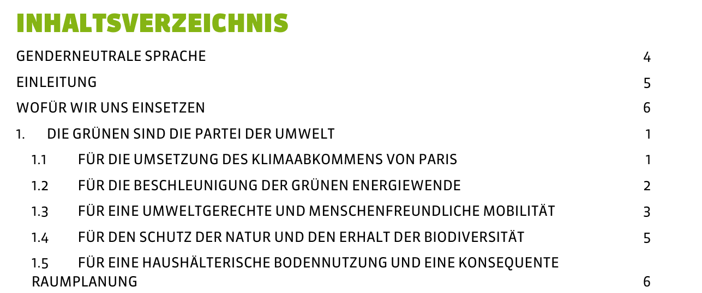

## Recap last Lecture

- well-solved assignment #1 :confetti_ball:
  - [example solution](https://github.com/aflueckiger/KED2024/blob/main/docs/assignments/assignment_1/flueckiger_KED2024_1_solutions.sh)
- counting words :1234:
  - particular words or entire vocabulary
- preprocessing ​and cleaning :soap:


::: notes

- Übung
  - Fragen?
  - Bearbeitungszeit unterschiedlich (1.5h - 8h)
  - Beispiellösungen mit Kommentaren aufgeschaltet, andere Wege möglich
- Frequenzanalysen
  - Übersicht gewinnen: Wo liegen Schwerpunkte?
  - komparative Vergleich über Zeit oder Akteure (z.B. Partei)
  - vergleichbar mit Ngram-Viewer

:::

## Outline

- introducing regular expression :sparkles:
- practicing the writing of patterns :roller_coaster:

::: notes

- Halbzeit von Semester, langsam gehts ans Eingemachte
- Simpler Plan, RegEx allerdings mühsam
  - starten mit Praxis, dann Erarbeitung theoretische Grundlagen

- uralt, aber unumgänglich für Data Cleaning
- je nach Zeit, nächstes Mal nochmals RegEx + Übungszeit

:::


# Text as Pattern

## Searching with Patterns

### How to extract **all email addresses** in a text collection? 

```markdown
Please contact us via info@organization.org.
- - -
For specific questions ask Mrs. Green (a.green@mail.com).
- - -
Reach out to support@me.ch as soon as possible.
```

. . .

:point_right: **Solution:** Write a single pattern to match any valid email adress

```bash
[A-Z0-9._%+-]+@[A-Z0-9.-]+\.[A-Z]{2,}	# case-insensitive
```

::: notes

- Was meint Text als Pattern?
  - am einfachsten an Problemstellung zu sehen
  - Email-Adressen sind immer nach dem gleichen Muster aufgebaut
  - ganze Sprache ist voller Muster --> Grammatik
- Frage an Studis: Wie macht ihr das?
  - Bsp. Marketing-Analyse oder Wistleblower Korpus
- allen bekannt: Suche in Text
  - Suche nach @ findet alle Adressen
  - wie aber extrahieren und welche Teile gehören genau dazu?
- kryptisch + hässlich, aber beliebig expressive Beschreibungssprache

:::


## Data Cleaning is paramount!

### Removing parts from real-word data

:::::::::::::: {.columns}

:::{.column width="50%"}



:::

:::{.column width="50%"}


:::

::::::::::::::


::: notes

- Dokumente haben immer auch Metainformation, die man separieren oder löschen will
  - Inhaltsverzeichnis, Impressum, Kopf/Fusszeilen, Seitenzahl

- Datenaufbereitung braucht viel Zeit
- einfaches Modell mit ein paar Zeilen Standard-Code, Bereinigung immer spezifisch für Datenquelle

[src](https://medium.com/koverhoop/data-cleaning-and-pre-processing-in-python-b28eea7ac045)

:::


## When using Patterns?

- finding :mag_right:
- extracting :hammer_and_wrench:
- removing/cleaning :wastebasket:
- replacing :repeat:

**... specific parts in texts**

::: notes

- RegEx mit breiter Anwendung
  - für Preprocessing Textanalysen unverzichtbar
  - Data Cleaning
- funktioniert genau gleich in Python, R und allen anderen Programmiersprachen

:::


## Use **egrep** with Regular Expressions

### **e**xtended **g**lobally search for **r**egular **e**xpression and **p**rint (egrep)

```bash
# check a regular expression quickly
echo "check my first pattern" | egrep "[0-9]"
echo "check my 1st pattern" | egrep "[0-9]"
```


::: notes

- Für Regex brauchen wir egrep
- egrep kann Wörter oder Regex suchen
  - Jedes Wort entspricht einem Regex. Einfach sehr limitiert.
- Pattern kurz innerhalb von Terminal testen
  - In Beispielssatz nach einem bestimmten Muster suchen
  - Beispielsatz wird direkt an egrep übergeben, ohne Umweg über Datei

- Was wird gematched?

:::

## **egrep** in Practice

### egrep filters/keeps matching lines only

```bash
egrep "yes" file.txt		# search in a specific file
egrep -r "yes" folder 		# search recursively within folder

egrep "yes"	*.txt			# keep lines containing pattern (yes) across txt-files
egrep -i "yes" *.txt		# dito, ignore casing (Yes, yes, YES ...)
egrep -v "noisy" *.txt		# do NOT keep lines containing noisy

# extract raw match only to allow for subsequent counting
egrep -o "only" *.txt		# print match only instead of entire line
egrep -h "only" *.txt		# suppress file name
```

::: notes

- egrep ist eigentlich ein Filter, der zeilenweise operiert
- Argumente sind teilweise Wiederholung
- Kurz verschiedene Argumente durchgehen

:::

## What are Regular Expressions (RegEx)?

### RegEx builds on two classes of symbols

- **literal** characters and strings
  - letters, digits, words, phrases, dates etc.
- **meta** expressions with special meaning
  - e.g., `\w` represents alphanumeric characters
  - `[Cc]o+l` &rarr; Col, col, Cool, coool ...
- akin to regular languages


::: notes

- Regex = Muster = formale Beschreibung von Zeichensequenz
- Erklären: String = Zeichensequenz
- zwei Arten von Zeichen
- Literale = Zeichen steht für tatsächliches Zeichen (buchstabentreue Repräsentation)
  - wie letztes Mal
  - wenn wir nach Wort suchen ist alles literal
- Meta-Zeichen steht für eine ganze Gruppe/Klasse an Zeichen
  - nützlich für abstrakte Beschreibung von Text
  - Lernen, wie verwenden ist Thema heutiger Sitzung
- genaue mathematische Definition hier nicht Thema

:::

## Quantifiers

### Repeat preceding character `X` times

- `?` zero or one
- `+` one or more
- `*` zero or any number
- `{n}`, `{m,n}` a specified number of times

```bash
egrep -r "Bundesrath?es"		# match with word with optional "h"
egrep -r "a+" 					# match one or more "a"
egrep -r "e{2}"					# match sequence of two "e"
```


:warning: Do not confuse regex with Bash wildcards!


::: notes

- erste Klasse von Meta-Symbolen: Quantifikatoren
- definieren Anzahl von vorangehendem Zeichen
- in Regex beziehen sich Operatoren auf vorderes Zeichen, in Wildcard nicht

:::


## Character Sets

* `[...]` any of the characters between brackets
  * any vowel: `[auoei]`
  * any digit: `[0-9]`
  * any letter: `[A-Za-z]`
* `[^...]` any character except those (**negation**)
  * anything but the vowels: `[^auoei]`


```bash
egrep -r "[Gg]rüne" # match both `grüne` and `Grüne`

egrep -r "[aeiou]{3}" # match sequences of 3 vowels

egrep -rohi "[a-z]+ [a-z]+" # extract bigrams (sequence of two words)
```


## Special Symbols

* `.` matches any character (excl. newline)
* `\` escapes to match literal 
  * `\.` means the literal `.` instead of "any symbol"
* `\w` matches any alpha-numeric character
  * same as `[A-Za-z0-9_]`
* `\s` matches any whitespace (space, newline, tab)
  * same as `[ \t\n]`


```bash
# match anything between brackets
egrep -r "\(.*\)"
```

::: notes

- Klammern sind auch Metasymbole

:::

## The power of `.*` :muscle: {data-background=#4d7e65} 

Match ***any character*** ***any times***


## More Complex Examples

```bash
# extract basename of URLs
egrep -ro "www\.\w+\.[a-z]{2,}"

# extract valid email adresses (case-insensitive)
egrep -iro "[A-Z0-9._%+-]+@[A-Z0-9.-]+\.[A-Z]{2,}" **/*.txt

```

::: notes

- bei Erstellung von Online-Accounts prüfen RegEx Validität von Email

:::

## Combining RegEx with Frequency Analysis

### Something actually useful

```bash
# count political areas by looking up words ending with "politik"
egrep -rioh "\w*politik" **/*.txt | sort | uniq -c | sort -h

# count ideologies/concepts by looking up words ending with "ismus"
egrep -rioh "\w*ismus" **/*.txt | sort | uniq -c | sort -h
```


::: notes

- bis jetzt Spielerei, um RegEx zu lernen
- Grundlage für Seminararbeit
  - systematisches Suchen, quantifizieren und analysieren von Begriffsverwendung


:::

## Start simple, <br>add complexity subsequently. {data-background-image=../images/knitting.jpg}

<!-- https://wallpaperscraft.com/download/needles_thread_knitting_105073/2048x1365 -->

## In-class: Exercise {data-background=#3c70b5}

1. Use the command line to navigate to the local copy of the Github repository KED2024 and make sure it is up-to-date with `git pull`.  Change in to the directory `KED2024/materials/data/swiss_party_programmes/txt`.
2. Use `egrep` to extract all uppercased words like `UNO, OECD, SP` and count their frequency (check hint below:point_down:).
3. Similarly, use `egrep` to extract all plural nouns with female endings (e.g., `Schweizerinnen`). The pattern matches words starting with an uppercase letter, ending with `innen`, and any letter in between. Do the same for the male forms. Is there a qualitative or a quantitative difference between the gendered forms?

```bash
# write a pattern 
egrep -roh "YOUR_PATTERN" **/*.txt | sort | uniq -c | sort -h
```

::: notes

- **Pause** (Zeit ist sehr knapp bis hier)
- CTRL+C um Befehl abzubrechen (falls länger als eine Sekunde dauert, ist etwas falsch)
- Start mit einfachem grep-Befehl, dann schauen, was gematcht wird und dann auszählen
- Nach Sitzung Upload der Lösungen

:::


## In-class: Solution {data-background=#3c70b5}

2. Use `egrep` to extract all uppercased words like `UNO, OECD, SP` and count their frequency.
   - `egrep -roh "[A-Z]{2,}" **/*.txt | sort | uniq -c | sort -h `

3. Use `egrep` to extract all plural nouns with female endings (e.g. `Schweizerinnen`). The pattern matches words that start with an uppercase letter, ending with `innen`, and any letter in between. Do the same for the male forms. Is there a qualitative or a quantitative difference between the gendered forms?

   - `egrep -roh "[A-Z][a-z]+innen\b" **/*.txt | sort | uniq -c | sort -h`

   - `egrep -roh "[A-Z][a-z]+er\b" **/*.txt | sort | uniq -c | sort -h` (there is no way with regular expression to extract only nouns of the male form but not `Wasser` and the like. For this, you have to use some kind of machine learning.)


## Replacing + Removing

### **s**tream **ed**itor (sed)

- advanced find + replace using regex
  - `sed "s/WHAT/WITH/g" file.txt`
-  `sed` replaces any sequence,  `tr` only single symbols


```bash
echo "hello" | sed "s/llo/y/g"		# replace "llo" with a "y"

# by setting the g flag in "s/llo/y/g",
# sed replaces all occurences, not only the first one
```


::: notes

- egrep für Extraktion, sed für Manipulation
  - wichtig um Daten aufzubereiten
- wie Suchen-Ersetzen-Funktion von Word, nur mächtiger dank Regex
- Löschen = Ersetzen mit leeren Sequenz
- flag "global"
- Demonstration mit \b
-  `echo "hello hell" | sed "s/l\b/lo/g"`

:::


## Contextual Replacing 

### reuse match with grouping

* define a group with parentheses `(group_pattern)`
* `\1`  equals the expression inside first pair of parentheses
* `\2`  expression of second pair
* ...


```bash
# swap order of name (last first -> first last)
echo "Lastname Firstname" | sed -E "s/(.+) (.+)/\2 \1/"

# matching also supports grouping
# match any pair of two identical digits
egrep -r "([0-9])\1"
```


::: notes

- Teilausdruck gruppieren zur Wiederverwendung
- Klammern sind ebenfalls Metazeichen

:::


## More Meta-Symbols

* `\b` matches word boundary
  * `word\b` does not match `words`
  
* `^` matches begin of line and `$` end of line
  * `^A` matches only `A` at line start
  
* `|` is a disjunction (OR)
  * `(Mr|Mrs|Mr\.|Mrs\.) Green` matches alternatives 


::: notes

- diese Symbole sind leer, sie matchen keine Zeichen
- spezifizieren Positon von regulärem Ausdruck
- line start hilfreich für übung

:::


## Greediness Trap

- greedy ~ match the longest string possible
- quantifiers `*` or `+` are greedy
- non-greedy by excluding some symbols
  -  `[^EXCLUDE_SYMBOLS]` instead of `.*`

```bash
# greedy: an apple, other apple
echo "an apple, other apple" | egrep "a.*apple"

# non-greedy: an apple
echo "an apple, other apple" | egrep "a[^,]*apple"
```

::: notes

- `.* ` = jegliche Zeichen, beliebige Länge

:::

## Assignment #2 :writing_hand:

- get/submit via OLAT
  - starting tomorrow
  - deadline 6 April 2024, 23:59
- use forum on [OLAT](https://lms.uzh.ch/auth/RepositoryEntry/16703095856)
  - subscribe to get notifications
- ask friends for support, not solutions


::: notes

- 

:::


## In-class: Exercises I{data-background=#3c70b5}

1. Use `egrep` to extract capitalized words and count them. What are the most frequent nouns?
2. Use `egrep` to extract words following any of these strings: `der die das`. Hint: Use a disjunction.
3. Do the self-check on the next slide.
4. Use `sed -E` to remove the table of content, the footer and the page number in the programme of the Green Party. Check the corresponding PDF to get a visual impression and test your regular expression with `egrep` first to see if you match the correct parts in the document.

## In-class: Solution I{data-background=#3c70b5}

1. Use `egrep` to extract capitalized words and count them. What are the most frequent nouns?
   - `egrep -roh "[A-Z][a-z]+" **/*.txt | sort | uniq -c | sort -h`
2. Use `egrep` to extract words following any of these strings: `der die das`. Hint: Use a disjunction.
   - `egrep -roh "(der|die|das) \w+" **/*.txt`
3. Use `sed -E` to remove the table of content, the footer and the page number in the programme of the Green Party. Check the corresponding PDF to get a visual impression and test your regular expression with `egrep` first to see if you match the correct parts in the document.
   - `cat gruene_programme_2019.txt | sed "1,192d" | sed -E "s/^Wahlplattform.*2023$//g" | sed -E "s/^[0-9]+$//g" `


## In-class: Self-Check{data-background=#3c70b5}

### Equivalent patterns

```bash
a+ == aa* 				# "a" once or more than once
a? == (a|_) 			# "a" once or nothing
a{3} == aaa				# three "a"
a{2,3} == (aa|aaa)		# two or three "a"
[ab] == (a|b)			# "a" or "b"
[0-9] == (0|1|2|3|4|5|6|7|8|9)	#any digit
```

## In-class: Exercise II{data-background=#3c70b5}

1. Count all the bigrams (sequence of two words) using character sets and quantifiers. What about trigrams (three words)?
2. Extract the words following numbers (also consider numbers like: `1'000, 1,000 or 5%`). Then, count all the words while excluding the numbers themselves. Hint: Pipe another grep to remove the digits.
3. You are ready to come up with your own patterns...

## In-class: Solution II{data-background=#3c70b5}

1. Count all the bigrams (sequence of two words) using character sets and quantifiers. What about trigrams (three words)?
   - `egrep -hoir "\b[a-z]+ [a-z]+\b" | sort | uniq -c | sort -h`
   - `egrep -hoir "\b[a-z]+ [a-z]+ [a-z]+\b" | sort | uniq -c | sort -h`
2. Extract the words following numbers (also consider numbers like: `1'000, 1,000 or 5%`). Then, count all the words while excluding the numbers themselves. Hint: Pipe another grep to remove the digits.
   - `egrep -rhoi "[0-9][0-9,'%]+ [a-z]+" | egrep -io "[a-z]+" | sort | uniq -c | sort -h`
   - Alternative: `egrep -rhoi "[0-9][0-9,'%]+ [a-z]+" | sed -E "s/[0-9][0-9,'%]+//g" | sort | uniq -c | sort -h`

## In-class: Exercise III{data-background=#3c70b5}

1. Since you know about RegEx, we can use a more sophisticated tokenizer to split a text into words. What  is the difference between the old and new approach?  Test it and check the helper page with `man`.

   ```bash
   # new, improved approach
   cat text.txt | tr -sc "[a-zäöüA-ZÄÖÜ0-9-]" "\n"
   
   # old approach
   cat text.txt | tr " " "\n" 	
   ```


## More Resources

### Helpful resources for assignment

- Ben Schmidt. 2019. [Regular Expressions](https://dsgithub.com/HumanitiesDataAnalysis/HDA19/blob/master/Handouts/01-regex.pdf).
- [Cheatsheet](https://aflueckiger.github.io/KED2024/materials/cheatsheet_command_line.pdf) of this course
- online regular expression editor
  - [regex101](https://regex101.com/) to write and check patterns

<br>

### recommended reading

- Nikolaj Lindberg. [egrep for Linguists](https://stts.se/egrep_for_linguists/egrep_for_linguists.pdf).


## Questions?{data-background="../images/paint-anna-kolosyuk-unsplash.jpg" .white-text}