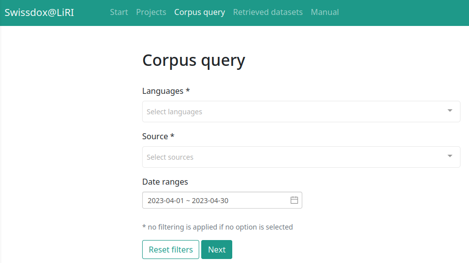
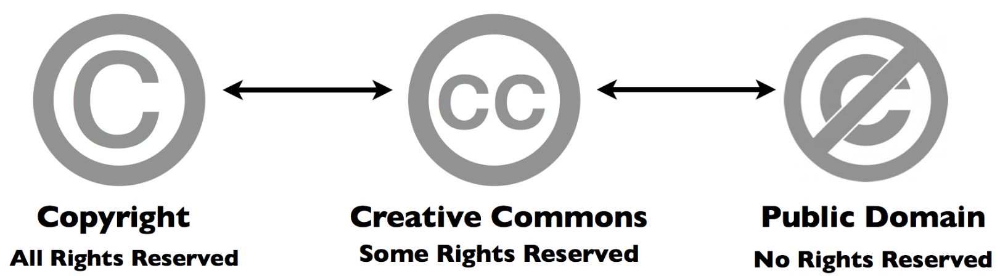
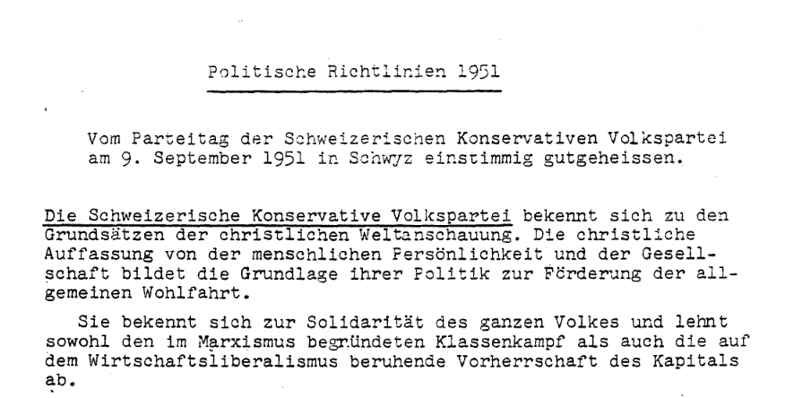
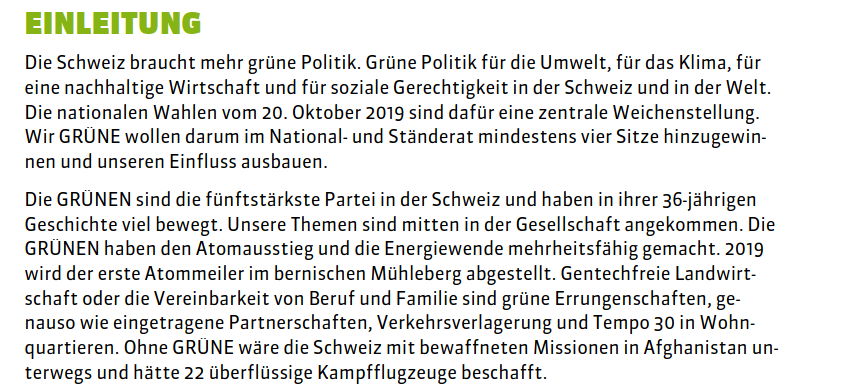

## Recap last Lecture

- describe text as pattern using RegEx
- extract + replace textual parts :jigsaw:
  - literal: `text a b c `
  - meta: `\w \s [^abc] *`
  - power of `.*`
- questions regarding assignment 2

::: notes

- Regex für Extraktion + Säubern
  - man muss nur ungefähr wissen wonach suchen
  - generalisierte Form = Muster
- Literale = Zeichen steht für tatsächliches Zeichen (buchstabentreu)
- Meta-Zeichen = Zeichen mit spezieller Bedeutung
- Fragen zu RegEx oder Übung?

:::

## Outline

- learn about available data sources
- Build and justify (!) your own dataset
  - any text :white_check_mark:
  - "any" format :white_check_mark:
  - from anywhere :white_check_mark:

::: notes

- heute letzte Sitzung zu Kommandozeile
- zweiteilige Sitzung mit wenig Technischem
  - von existierende Datenquellen, zur Aufbereitung eigener Daten
- interessannte Datasets für die Sozialwissenschaften
  - es gibt allerdings nicht viele
  - zumeist eigene Daten präparieren
- eigene Textdaten nutzen unabhängig von
  - Formaten
  - historischem Kontext (digital native)
- Überlegen, was für eine Analyse in MiniProject

:::

# Data Sources{data-background-image=../images/text_data_mining.jpg}

## What Data Sources are there?

- broadly social
  - newspapers + magazines
  - websites + social media
  - reports by NGOs/GOs
- scientific articles
- economic
  - business plans/reports
  - contracts
  - patents

:point_right: basically, any textual documents...


:::  notes

- unheimliche Vielfalt an Dokumenten, alles neue digital
- Textkollektion ist bereits vorhanden im Gegensatz zu Survey
  - given data statt created data
  - Datenbereinigungen sind nötig
- hier nur einen Bruchteil vorgestellt, soll als Inspiration dienen
  - Zeit reicht nicht, um auf alle Quellen einzugehen

[Image Credits](https://www.copyrightuser.org/understand/exceptions/text-data-mining/)

::: 


## Some great (historical) Corpora

### Ready off-the-shelf, machine-readable

- [1 August speeches by Swiss Federal Councilors](https://www.republik.ch/2019/08/01/anleitung-fuer-die-perfekte-ansprache-zum-1-august)
  - provided via [course repo](https://github.com/aflueckiger/KED2024/blob/main/KED2024/materials/data/dataset_speeches_federal_council_2019.csv)
- [Human Rights Reports by various NGOs](https://dataverse.harvard.edu/dataset.xhtml?persistentId=doi:10.7910/DVN/IAH8OY)
- [United Nations General Debate Corpus](https://dataverse.harvard.edu/dataset.xhtml?persistentId=doi:10.7910/DVN/0TJX8Y)

. . .

<br>

:sweat: There are still not many.

::: notes

- sehr wenige standardisierte Datasets
- nicht wie bei Survey-Forschung (ESS), numerischer Daten aus Politik und Ökonomie

:::


## [Swissdox](https://swissdox.linguistik.uzh.ch/): A game changer

### Assemble corpus and export as `.csv`

:::::::::::::: {.columns}

:::{.column width="50%"}

* over 250 Swiss newspapers
* historical and updated daily
* needs registration

:::

:::{.column width="50%"}




:::

:::::::::::::: 


::: notes

- Medienberichte vielleicht spannendste Quelle für Analyse sozialer Phänomene
- Längsschnitt (historisch) und Querschnittdaten (Verlage)
- Analyse von diesen Datensätzen nach Osterpause

:::

## More Interesting Publishers

* [Nexis Uni](http://www.nexisuni.com/)
  * international newspaper, business + legal reports
  * licensed by the university
* [Constellate](https://constellate.org/builder/)
  * scientific articles of JSTOR across disciplines
  * provides an easy dataset builder
* [Project Gutenberg](https://www.gutenberg.org/) and [HathiTrust](https://www.hathitrust.org/datasets)  
  * massive collection of books
  * open, HathiTrust requires agreement

:point_right: check out other resources licensed by [ZHB](https://www.zhbluzern.ch/recherche/e-medien)

::: notes

- Nexis ähnlich Swissdox, aber international
  - Zugang tlw. über ezproxy

- Constellate
  - kurze Demo von Constellate
  - brandneue Platform
  - einfache Zusammenstellung von JSTOR Artikeln 
  - sehr gute Metadaten
  - auch gut für schnelle Recherchen ohne Download
- Wieso Literatur? --> Zeitgeist
  - genderspezifische Sprache, Verweise Natur/Umwelt

:::


## Search existing Datasets

* [Harvard Dataverse](https://dataverse.harvard.edu/)
  * open scientific data repository
* [Google Dataset Search](https://datasetsearch.research.google.com)
  * Google for datasets basically


<br>

:point_right: search for a topic followed by `corpus`, `text collection` or `text as data`


::: notes

* fortschrittliche Wissenschaft veröffentlicht nicht nur Papers, sondern auch Daten und Code
  * computergestützte Textanalyse ist aber immer noch Nische
* Suchmaschinen für Datensätze
  * allerlei Datensätze, primär aus Wissenschaft


:::


## Online Computational Text Analysis

* [Google Ngram Viewer](https://books.google.com/ngrams#)
  * no filtering option
  * useful for quick analysis
* [bookworm HathiTrust](https://bookworm.htrc.illinois.edu)
  * great filtering by metadata
  * credible scientific source
* [Impresso](https://impresso-project.ch/app/)
  * many historical newspapers + magazines (CH, LU)
  * free, requires account

::: notes

- Erwähnen, aber nicht gross drauf eingehen
- Datenanalysen online durchführen
- Absicherung über andere Quellen

:::


## Search Techniques :mag: {data-background=var(--green)}

Make your web search more efficient by using dedicated [tags](https://support.google.com/websearch/answer/2466433?hl=en). Examples:

- `"computational social science"`
- `site:nytimes.com`
- ` nature OR environment`

::: notes

- Quotes für Wörter die zusammen gehören
  - Summe von Wörter haben evtl andere Bedeutung 

- Boolean Search 
  - OR / AND

:::


## Data is Property :no_entry_sign:

### ... and has rights too

- copyright may further limit access to high quality data
- check the rights before processing data


{width=70%}


::: notes

- Zugang zu Daten nicht immer einfach
  - open data unterschiedlich unterstützt
- Datenbereitstellung oftmals Teil von Geschäftsmodell
  - dann restriktiv
- oftmals ist Verwendung nicht geregelt
  - nutzt Graubereich

:::


# Preparing your own Data

## . <span style="color:#0c0c0c;">A world for humans ...<br>... and a jungle of file formats. </span>  {data-background-image=../images/file_types.jpg}

<!-- https://www.studio-24-7.com/file-formats-and-their-uses-explained/ -->

::: notes

- extrem viele File-Typen
- mühsam, aber es gibt einfache Tools für Umwandlung

:::


## Common Conversions

### news, press releases, reports from organizations

:::::::::::::: {.columns}

:::{.column width="50%"}

:arrow_down:

digital native documents <br>`.pdf`, `.docx`, `.html`<br>

:arrow_down:

convert to `.txt`

:::

:::{.column width="50%"}

:arrow_down:

scans of (old) documents <br>`.pdf`, `.jpg`, `.png`<br>

:arrow_down:

Optical Character Recognition (OCR) 

:::

:::::::::::::: 

<br>

**machine-readable** :white_check_mark:


::: notes

- PDF ist Publikationsstandard
  - digitale PDF  vs Scans (Unterschied werden wir gleich anschauen)

- anschliessend Schritte zur Umwandlung der wichtigsten Formate
- Keine Konzepte lernen, wie bei RegEx
  - nur welches Tool, für welche Umwandlung
  - mehr oder weniger copy-paste
- **Pause (etwas früher)**

:::

## Conversion of DOCX

### Use case: news articles from [Nexis](https://www.nexisuni.com/)

- `pandoc` to convert many file formats
- download as single articles in `.docx` on Nexis

```bash
# convert docx to txt
pandoc infile.docx -o outfile.txt

### Install first with
brew install pandoc 	# macOS
sudo apt install pandoc # Ubuntu
```


::: notes

- Konversion von Word-Dokumenten
  - Nexis-Plattform (Daten für Assignment 2 kommen von dort)

- Nexis = News-Datenbank
  - freier Zugang ezproxy
  - kennen ezproxy alle?
- zusätzliche Installation erforderlich
- pandoc ist ein fast-alles Könner für Dokumentkonversion
  - kann auch HTML


:::


## PDF: Digitalized or Digital?

### Two flavours of PDF documents

:::::::::::::: {.columns}

:::{.column width="50%"}

{height=6cm}

:::

:::{.column width="50%"}

{height=6cm}

:::

::::::::::::::


::: notes

- neue (digital) vs. alte (scans)
- Kriterium: Textsuche möglich?
- unterschiedliche Konvertierung nötig

:::

## Conversion of native PDF

### Use case: [Swiss party programmes](https://visuals.manifesto-project.wzb.eu/mpdb-shiny/cmp_dashboard_dataset/)

- `pdftotext` extracts text from non-scanned PDF

```bash
# convert native pdf to txt
pdftotext -nopgbrk -eol unix infile.pdf

### Install first with
brew install poppler 			# macOS
sudo apt install poppler-utils 	# Ubuntu
```


::: notes

- Einfacher Fall im Fall von digitalen PDF
- pdftotext: Name ist Programm
  - Outputfilename kann nicht spezifiziert werden
- dieselben Parteiprogramme, die wir schon analysiert haben
- Layout kann Extraktion erschweren
  - Spalten/Tabelle
- Häufigkeitsanalysen von Wörter sind robust, Struktur egal

:::

## Optical Character Recognition (OCR)

:::::::::::::: {.columns}

:::{.column width="50%"}

- OCR ~ convert images into text
  - extract text from scans/images
- `tesseract` performs OCR
  - language-specific models
  - supports handwriting + Fraktur texts
- image quality is crucial


:::

:::{.column width="50%"}


:::

::::::::::::::


::: notes

- tatsächlicher Buchstabe, nicht nur Bild davon

- Zwischenschritt Verbesserung Kontrast, B/W

- technisch Deep-Learning, nicht weiter von Bedeutung

- früher teure Programme, heute können das auch Smartphones
  - für viele/grosse Dokumente jedoch nicht geeignet


:::


## Conversion of digitalized PDF

### use-case: [historical party programmes](https://visuals.manifesto-project.wzb.eu/mpdb-shiny/cmp_dashboard_dataset/)

1. extract image from PDF + improve contrast
2. run optical character recognition (OCR) on the image

```bash
# convert scanned pdf to tiff, control quality with parameters
convert -density 300 -depth 8 -strip -background white -alpha off \
infile.pdf temp.tiff

# run OCR for German ("eng" for English, "fra" for French etc.)
tesseract -l deu temp.tiff file_out

### Install first with
brew install imagemagick			# macOS
sudo apt-get install imagemagick	# Ubuntu
```

::: notes

- Zwei Schritte: Bildumwandlung + OCR
- tesseract funktioniert für viele Bildformate
  - nicht direkt für PDF
- Beispiel: Kassenbon fotografieren & mit Regex parsen
- Kurz PDF und dann extrahierter Text zeigen

:::

## Configure ImageMagick

### Only Windows Ubuntu: Paste the following in your command-line

```bash
# disable security policy for Windows
sudo sed -i '/<policy domain="coder" rights="none" pattern="PDF"/d' /etc/ImageMagick-6/policy.xml

# increase memory limits
sudo sed -i -E 's/name="memory" value=".+"/name="memory" value="8GiB"/g' /etc/ImageMagick-6/policy.xml
sudo sed -i -E 's/name="map" value=".+"/name="map" value="8GiB"/g' /etc/ImageMagick-6/policy.xml
sudo sed -i -E 's/name="area" value=".+"/name="area" value="8GiB"/g' /etc/ImageMagick-6/policy.xml
sudo sed -i -E 's/name="disk" value=".+"/name="disk" value="8GiB"/g' /etc/ImageMagick-6/policy.xml
```

::: notes

- Erhöhe Limits für ImageMagick

:::

## #LifeHack: Make a PDF searchable {data-background=var(--green)}

### Use case: scanned book chapters

```bash
# output searchable pdf instead of txt
convert -density 300 -depth 8 -strip -background white -alpha off -compress group4 \
file_in.pdf temp.tiff

tesseract -l deu temp.tiff file_out pdf
```


::: notes

- Output als PDF statt Text
- für Suchen/Zitate rauskopieren
- convert hier mit Kompression, da PDFs zu gross werden ansonsten
- Kurz searchable-PDF zeigen

:::


## Scraping PDF from Websites

### Use case: [Swiss voting booklet](https://www.bk.admin.ch/bk/de/home/dokumentation/abstimmungsbuechlein.html)

- `wget` to download any files from the internet

```bash
# get a single file
wget EXACT_URL

# get all linked pdf from a single webpage
wget --recursive --accept pdf -nH --cut-dirs=5 \
--ignore-case --wait 1 --level 1 --directory-prefix=data \
https://www.bk.admin.ch/bk/de/home/dokumentation/abstimmungsbuechlein.html

# --accept FORMAT_OF_YOUR_INTEREST
# --directory-prefix YOUR_OUTPUT_DIRECTORY
```


::: notes

- bis hierher: Wie Daten in txt Format bringen
- jetzt Download automatisieren
  - Vorteil: schneller systematischer Download & Dokumentation von Quellen
- Haupt-URL angeben, wo PDF verlinkt sind
- Scraping von Blogs möglich über Python
  - nicht Teil von Seminar
- nicht auf alle Argumente eingehen 

:::

## Interesting Resources

* [Party Programmes across Europe](https://visuals.manifesto-project.wzb.eu/mpdb-shiny/cmp_dashboard_dataset/)
  * covers over 1000 parties from 1920 until today in over 50 countries

* [Swissvotes](https://swissvotes.ch)
  * collection of resources on Swiss public votings

* [Swiss voting booklets](https://www.bk.admin.ch/bk/de/home/dokumentation/abstimmungsbuechlein.html)
  * from 1978 until today

* [1 August speeches by Swiss Federal Councillors](https://www.admin.ch/gov/de/start/dokumentation/reden/ansprachen-zum-nationalfeiertag.html)
* [Nestlé Annual Reports](https://www.nestle.com/csv/performance/downloads)
* ... any organization of your interest :thumbsup:

## What data are you interested in?

### Think about the topic of your mini-project


 ](../images/illustration_of_text_analysis.jpg)

::: notes

- Je nach Datenquelle, Aufbereitung unterschiedlich aufwendig
- nun alles da für Mini-Project, ausser wenn Lösung in Python

:::

## Basics of Batch Processing

### perform the same operation on many files

```bash
# loop over all txt files
for file in *.txt; do

	# indent all commands in loop with a tab

	# rename each file
	# e.g. a.txt -> new_a.txt
	mv $file new_$file

done
```


::: notes

- Batch Processing = gleiche Operation durchführen für alle Files
- Erklären von Loop/Schleife und Variable
  - Wildcard zur Selektion > Liste von Files > Variable
- for-loop wichtiges Programmierkonzept
- Tabulator fürs Einrücken

:::

## Perform OCR for many PDF

```bash
for FILEPATH in *.pdf; do
	# convert pdf to image
    convert -density 300 $FILEPATH -depth 8 -strip \
    -background white -alpha off temp.tiff
    
    # define output name (remove .pdf from input)
    OUTFILE=${FILEPATH%.pdf} 
    
    # perform OCR on the tiff image
    tesseract -l deu temp.tiff $OUTFILE
    
    # remove the intermediate tiff image
    rm temp.tiff

done
```


::: notes 

- sehr ähnlich wie vorher, nur für jedes einzelne File jetzt

:::

# Questions?{data-background="../images/paint-anna-kolosyuk-unsplash.jpg" .white-text}

## In-class: Exercises I{data-background=var(--blue)}

1. Make sure that your local copy of the Github repository KED2024 is up-to-date with `git pull`.  Check out the data samples in `materials/data` and the scripts to extract their text in `materials/code`.
2. Decide on one use-case that interests you most. Install the missing tool with the commands given on the respective slides (e.g.,  `pandoc, imagemagick, poppler`).
3. **Apply the commands to reproduce on the given data. Test them on your own data. Check the resources. Ask questions. Think about your mini-project.**

## In-class: Exercises II{data-background=var(--blue)}

1. Use `wget` to download *cogito* and its predecessor *uniluAKTUELL* issues (PDF files) from the [UniLu website](https://www.unilu.ch/magazin/service/pdf-und-archiv/#section=c67079). Start with downloading one issue first and then try to automatize the process to download all the listed issued using arguments for the `wget` command.
2. Convert the *cogito* and *uniluAKTUELL* PDF files into TXT files using `pdftotext`. Try with a single issue first and then write a loop to batch process all of them.
3. What is the University of Lucerne talking about in its issues? Use the commands of the previous lectures to count the vocabulary.
4. Do the same as in 3.), yet analyze the vocabulary of *cogito* and *uniluAKTUELL* issues separately. Does the language and topics differ between the two magazines?

## In-class: Exercises III{data-background=var(--blue)}

1. Use `wget` to download a book from Project Gutenberg and count some things (e.g., good/bad, joy/sad).
2. `wget` is a powerful tool. Have a look at its arguments and search for more examples in tutorials on the web.

## Resources

### Make a more sophisticated script for PDF-to-TXT conversion

- Erick Peirson. 2015. Tutorial: Text Extraction and OCR with Tesseract and ImageMagick - Methods in Digital and Computational Humanities - DigInG Confluence. [online](https://diging.atlassian.net/wiki/spaces/DCH/pages/5275668/Tutorial+Text+Extraction+and+OCR+with+Tesseract+and+ImageMagick)

## Have a nice <br>Easter break! {data-background-image=../images/easter-eggs.jpg}
