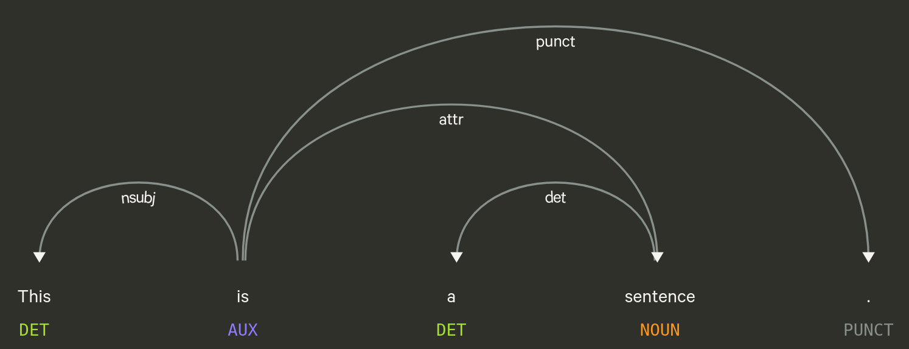

## Recap last Lecture

- perform first real-world (data) analysis :bar_chart:
  - analyse discourse on wokeness in Swiss media

## Outline

- get some organizational stuff done
- let's do serious NLP! :sparkles:
- code interactively
  - interrupt, ask, and complement

::: notes

- im Vergleich zum letzten Mal stärker Foku auf Text und nicht nur Metadaten
- Stellschrauben kennen lernen, Gefühl für die Sprache entwickeln
  - Details vorerst unwichtig
- drittletzte Sitzung, neue Inhalte nur noch heute und nächstes Mal

:::

# Organizational

## Course Evaluation{data-background-image=../images/speech_bubbles.gif}

## Tell me... :mega:{data-background=var(--blue)}

### Please follow the link in the email, received on 8 May 2024

 

### Thanks for any constructive feedback,  be it sweet or sour! :pray:

::: notes

- offene Kommentare nutzen, statt nur Kreuze
- 5min Zeit zum ausfüllen
- andere Code anschauen
- Tell me...
  - ... what you disliked
  - ... what you missed
  - ... what you learned

:::

## ~~Assignment #3~~ :writing_hand:

### No further assignements!

- Focus on the mini-project!

- Record your projects [here](https://docs.google.com/spreadsheets/d/1okuYtiMeASZzenn-VADvg1i6mWqVNsOaskuiHP-sTVc/edit#gid=0) by 18 May!

::: notes

- Feiertage lassen sich nicht so gut vereinbaren mit Kursprogramm
- Zusammenstellung von Datensätzen wird ab heute abgeschlossen sein
- Analysetechniken gehen noch weiter in die Tiefe

:::

## Issues on Mac

### ModuleNotFoundError: No module named `plotnine`

- the [issue](https://github.com/RaRe-Technologies/gensim/pull/3402) is the consequence of a failed `gensim` installation
- navigate to project folder `KED2024` in Terminal
- run the following commands
  - `poetry remove scattertext`
  - `poetry install`

::: notes

- betrifft nur einen Aspekt von Analyse von Kurs
- interaktive Analyse auch aus Zeitgründen gestrichen

:::

# A Primer on classic NLP{data-background-image=../images/words.jpg}

## What is a Word?

- words ~ segments between whitespace
- yet, there are ...
  - contractions: `U.S.`, `don't`
  - collocations: `New York`

## Token

:::::::::::::: {.columns}
::: {.column width="50%"}

- token ~ computational unit
  - representation of words
- lemma ~ base form of a word
  - `texts` &rarr; `text`
  - `goes` &rarr; `go`
- stop words ~ functional words
  - lacking deeper meaning
  - `the`, `a`, `on`, `and` ...

:::

::: {.column width="50%"}

:::

::::::::::::::

 

 `Let's tokenize this sentence! Isn't is easy?` :nerd_face:

::: notes

- Text wird in seine Teile gesplittet
- Lemma ~ Form in Duden

:::

## Common Processing Steps in NLP

:::::::::::::: {.columns}
::: {.column width="50%"}

1. Tokenizing
   - segmenting text into words, punctuations etc.
2. Tagging part-of-speech (POS)
   - assigning word types (e.g. verb, noun)
3. Parsing
   - describing syntactic relations
4. Named Entity Recognition (NER)
   - organizations, persons, locations, time etc.

:nerd_face: Catch up on NLP with  @Jurafskyforthcominga

:::

::: {.column width="50%"}

:::

::::::::::::::

::: notes

- Abfolge von Prozessierungsschritten
- alles sprachabhängig
- Tagging: ca. 20-30 POS tags
- Parsing
  - Verb ist Head von Satz
  - Subjekt-Verb-Objekt

:::

# Questions?{data-background-image="../images/paint-anna-kolosyuk-unsplash.jpg" .white-text}

## References
